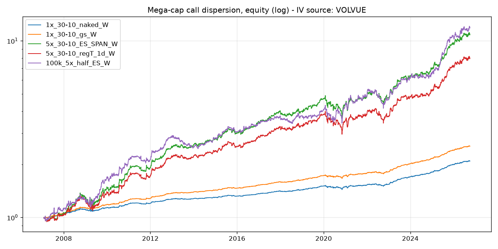
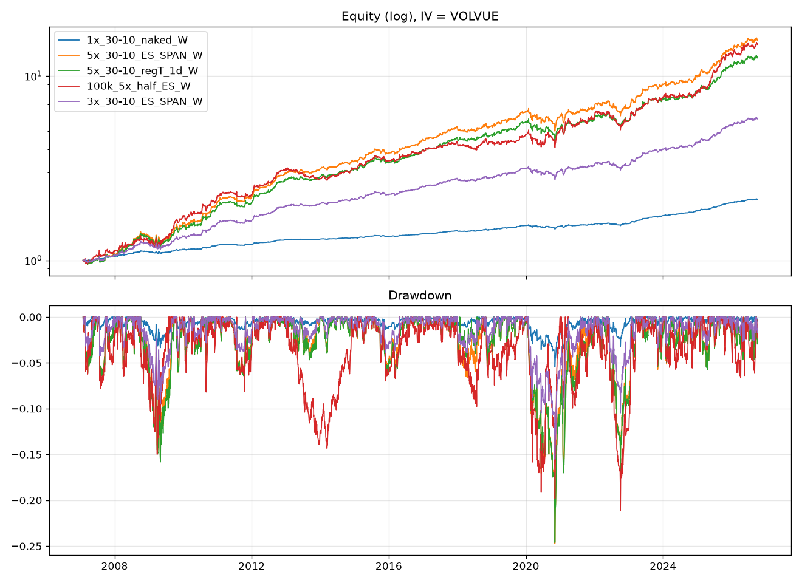

# Mega-cap Call Dispersion (GS institutional + tastytrade retail)

Systematic options strategy: **long single-name upside convexity, short index
upside convexity**, delta- and notional-matched, hedged weekly. Built from
scratch to the specification in the build prompt: point-in-time universe,
monthly cycle, Black-Scholes flat-IV backtest with explicit retail /
institutional costs, and an execution layer for tastytrade (ES/MES futures
options under SPAN) or a prime broker (naked SPY calls under portfolio margin).

```
dispersion/
  config.py              every parameter of the spec (deltas, sizing, costs, rails)
  bs.py                  Black-Scholes pricing/delta + K = S*exp(-z_d*s + s^2/2) strike rule
  data/constituents.py   point-in-time S&P 500 membership (fja05680/sp500, no survivorship)
  data/prices.py         yfinance daily closes / volume / shares / splits, parquet cache
  data/universe.py       top-100 by market cap -> top-30 by trailing-12m median $ volume
  data/rates.py          FRED FEDFUNDS, VIXCLS, CBOE single-name vol indices
  data/iv.py             IV provider interface, CSV loaders (ORATS/IvyDB), labelled PROXY fallback
  data/volvue.py         VolVue /query client: iv_call_30, iv_put_30, iv_mean_30, iv_skew_30 (cached)
  backtest/engine.py     monthly roll, weekly hedge, costs, leverage, Reg-T / naked / ES variants
  backtest/metrics.py    CAGR, vol, Sharpe, Sortino, maxDD, Calmar, beta, yearly, 2nd-half
  execution/strikes.py   listed-chain strike selection from IV30 (furthest strike for the 1-delta wing)
  execution/sizing.py    0.9*L/N sizing, rotating 15-name half, 2x-contract skip, margin/flatten rails
  execution/orders.py    limit-walk algorithm: mid -> far side in 3-4 steps of 20% half-spread, 15-20 s
  execution/hedge.py     weekly net $-delta at entry IVs -> SPY shares or MES
  execution/broker.py    Broker interface + PaperBroker (synthetic chains/quotes for offline validation)
  execution/tastytrade.py OAuth2, chains, quotes, order & margin dry-run, submit/replace/cancel
  execution/institutional.py naked SPY (or 1-delta Reg-T spread) index ticket, GS cost model
  execution/runner.py    CLI: roll / hedge / status, dry-run first, 60% margin rail
scripts/fetch_data.py    download everything
scripts/run_backtest.py  run the variant grid, write results/summary_<TAG>.csv
scripts/report.py        markdown table vs reference numbers + equity chart
scripts/risk_report.py   VaR/CVaR, skew, drawdown duration, down-beta, crisis windows, yearly table
scripts/run_overlay.py   long SPY + sleeve overlay at 1x/3x/5x
scripts/reconcile.py     accounting-convention reconciliation (costs, additive vs compounded, daily vs monthly DD)
scripts/run_realistic.py most realistic tastytrade cost model, full risk stats across L and account size
tests/                   16 tests: BS/delta targets, strike picks, sizing, rails, hedge, limit walk, engine accounting
```

## Quick start

```bash
pip install -r requirements.txt
python scripts/fetch_data.py          # ~10 min: 976 historical S&P tickers, shares, splits, FRED
python scripts/fetch_volvue.py        # VOLVUE_API_KEY: traded 30d IVs (else the engine uses the PROXY)
python scripts/run_backtest.py        # all variants, 2007-01 .. today
python scripts/report.py VOLVUE       # table + results/equity_VOLVUE.png
python scripts/risk_report.py VOLVUE  # tails, crisis windows, drawdowns -> results/risk_VOLVUE.md
python -m pytest -q
# execution, offline mechanics check (no credentials needed):
python -m dispersion.execution.runner roll  --paper --dry-run --leverage 3 --index-mode ES
python -m dispersion.execution.runner hedge --paper --dry-run
```

## Implied vols: VolVue (traded) is wired in; the proxy stays as a fallback

`data/volvue.py` pulls daily `iv_call_30` / `iv_put_30` / `iv_mean_30` /
`iv_skew_30` for every universe ticker plus SPY from the VolVue query API
(`VOLVUE_API_KEY`), caches them in `data/cache/volvue_iv30.parquet`, and
`get_provider("auto")` selects them whenever the cache exists. Coverage is
99.8% of the top-30 slots every month from 2006 (VolVue also carries the
delisted 2008 names, but yfinance has no prices for them, so they still cannot
be traded). The engine prices with `iv_call_30`, the wing we trade.

```bash
export VOLVUE_API_KEY=...
python scripts/fetch_volvue.py            # ~3 min, 679 tickers, 3.15M rows
python scripts/run_backtest.py --iv volvue
python scripts/report.py VOLVUE && python scripts/risk_report.py VOLVUE
```

Data check (`results/iv_diagnostic_volvue_vs_proxy.csv`): VolVue's
cross-sectional median single/SPY 30d IV ratio is 1.48 over 2007-2026 (spec:
1.59 traded, 1.57 break-even), its SPY level sits 1-3 points under VIX as an
ATM 30-day IV should, and call minus put IV is +0.4 pts for SPY and +0.2 pts
for singles. Without the key the engine falls back to a VIX-anchored PROXY,
labelled as such on every output (`results/*_PROXY.*`).

## Results on VolVue IV (2007-01 .. 2026-10, net of retail costs)



Two drawdown columns: `maxdd` on daily marked equity (what a margin desk sees),
`maxdd_m` on month-end equity (the convention behind the spec's reference).

| variant                        | cagr   | vol   | sharpe | sortino | maxdd  | calmar | maxdd_m | calmar_m | calmar_2h | beta | worst_m | 2008   | 2022  | reference (spec section 8) |
|:-------------------------------|:-------|:------|-------:|--------:|:-------|-------:|:--------|---------:|----------:|-----:|:--------|:-------|:------|:---------------------------|
| 1x_30-10_naked_W               | +4.0%  | 2.1%  |   1.85 |    2.38 | -5.4%  |   0.73 | -3.4%   |     1.15 |      0.83 | 0.04 | -1.2%   | +6.2%  | +0.8% | Sharpe 1.36, maxDD -2.9%, Calmar 1.07, gross +2.97%/yr, net +2.2..3.1% |
| 1x_30-10_naked_nohedge         | +3.2%  | 2.5%  |   1.30 |    1.23 | -4.3%  |   0.74 | -2.6%   |     1.23 |      0.75 | -0.01| -2.3%   | +6.6%  | +2.3% | hedge adds ~0.5 Sharpe |
| 1x_30-10_naked_D               | +3.7%  | 2.1%  |   1.78 |    2.84 | -3.9%  |   0.95 | -3.2%   |     1.16 |      1.17 | 0.05 | -1.0%   | +3.7%  | -0.9% | daily: no Sharpe gain |
| 1x_longcall_naked_W            | +3.5%  | 2.9%  |   1.17 |    1.76 | -6.0%  |   0.57 | -5.5%   |     0.62 |      1.11 | 0.03 | -2.0%   | +3.4%  | -1.0% | 30-10 vertical is the structure |
| 1x_30-10_regT_1d_W             | +3.7%  | 2.1%  |   1.77 |    2.29 | -5.4%  |   0.69 | -3.5%   |     1.08 |      0.80 | 0.04 | -1.3%   | +6.0%  | +0.6% | ~0.1 Sharpe below naked |
| 1x_30-10_regT_5d_W(rejected)   | +2.5%  | 2.0%  |   1.26 |    1.55 | -5.5%  |   0.46 | -3.9%   |     0.65 |      0.58 | 0.02 | -1.4%   | +4.7%  | -0.2% | rejected: 5-delta wing |
| 1x_30-10_gs_W                  | +4.8%  | 2.1%  |   2.25 |    2.88 | -4.7%  |   1.03 | -2.7%   |     1.77 |      1.14 | 0.04 | -1.2%   | +7.5%  | +1.7% | institutional costs |
| 5x_30-10_naked_W               | +14.8% | 10.1% |   1.42 |    1.81 | -24.9% |   0.60 | -16.4%  |     0.90 |      0.55 | 0.21 | -6.5%   | +26.8% | -2.3% | +17.7%/yr, vol 11.5%, Sharpe 1.54, Sortino 3.4, maxDD -13.6%, Calmar 1.31, beta 0.37, worst -7.0%, 2008 +15% |
| 5x_30-10_ES_SPAN_W             | +15.0% | 10.1% |   1.43 |    1.83 | -24.7% |   0.61 | -16.3%  |     0.92 |      0.55 | 0.21 | -6.4%   | +27.0% | -2.1% | default retail product |
| 5x_30-10_regT_1d_W             | +13.7% | 10.0% |   1.34 |    1.76 | -24.6% |   0.56 | -16.6%  |     0.82 |      0.51 | 0.19 | -6.3%   | +25.3% | -3.0% | Sharpe 1.46-1.55, Calmar 1.19-1.28 |
| 5x_30-10_gs_W                  | +18.1% | 10.1% |   1.70 |    2.16 | -22.5% |   0.80 | -14.1%  |     1.28 |      0.75 | 0.21 | -6.3%   | +32.0% | +1.1% | |
| 5x_30-10_spec_headline_costs_W | +17.8% | 10.1% |   1.67 |    2.21 | -21.9% |   0.82 | -13.5%  |     1.32 |      0.76 | 0.21 | -6.3%   | +33.5% | +1.7% | flat 0.7%/yr per 1x: reproduces the reference |
| 100k_5x_half_ES_W              | +14.7% | 11.9% |   1.21 |    1.68 | -21.1% |   0.70 | -15.2%  |     0.97 |      0.70 | 0.25 | -7.7%   | +13.5% | -5.4% | +19.6%/yr, Sharpe 1.44, Calmar 1.12 |
| 3x_30-10_ES_SPAN_W             | +9.4%  | 6.1%  |   1.50 |    1.88 | -15.5% |   0.60 | -10.0%  |     0.94 |      0.58 | 0.12 | -3.8%   | +16.2% | -0.6% | recommended live start |

Full risk tables (VaR/CVaR, skew/kurtosis, drawdown duration, down-market
beta, crisis windows, calendar years) are in `results/risk_VOLVUE.md`;
drawdown paths in `results/drawdown_VOLVUE.png`.



### Most realistic retail scenario

`scripts/run_realistic.py` -> `results/realistic_VOLVUE.md` / `.png`. Costs:
per-leg half-spreads as specified without the 1.3 exit/roll multiplier (hold
to expiry), tastytrade commissions $1/contract capped at $10/leg, $0.15
clearing+exchange per contract uncapped, ES/MES options $3/contract all-in,
1bp hedge turnover. At 5x on ES/MES: +15.9%/yr, vol 10.1%, Sharpe 1.51,
maxDD -23.8% daily / -15.4% month-end, Calmar 0.67 / 1.03, beta 0.21,
worst month -6.4%, 2008 +28%, all-in cost 4.8%/yr of equity.

### The index leg priced from real trades: the edge disappears

The short 30-delta SPX call can be taken from actual settlement prices
instead of a model: Cboe's BXMD index writes exactly that option every 3rd
Friday since 1986 (BXM at-the-money, BXY 2% OTM), and its return minus the
S&P 500 total return is the realised P&L of the leg, skew included.
`index_leg="BXMD"` in the engine does this (cycle on 3rd Fridays so the
dates align; the singles still use VolVue IV, which the live-chain check
showed prices them within 2%). Scripts: `run_real_index_leg.py`,
`results/index_leg_real_vs_model.csv`, `results/real_index_leg_VOLVUE.md`,
`results/reverse_VOLVUE.csv`, `results/put_overlay_VOLVUE.csv`.

Short 30-delta SPX call held to expiry, 2007-2026, per cycle as % of notional:
real (BXMD) **-0.24%** = -2.9%/yr; flat-IV model **+0.04%** = +0.5%/yr;
correlation of the two series 0.93, and the model exceeds the real leg in 19 of
20 calendar years (1.5-8%/yr). The implied premium actually collected is 0.68
of the model's, against 0.84 measured on today's low-skew chain. The reason is
simple: the SPX 30-delta call trades at roughly realised vol (ATM 15.2 - skew
1.7 vs realised 13.5), so there is no premium in it to sell; the flat-IV engine
sells it at ATM vol and books the ATM variance premium that the market does
not pay on that strike.

Realistic costs, dividends on, 3rd-Friday cycle, VolVue singles:

| variant | CAGR | Sharpe | maxDD daily | 2008 | 2022 |
|---|---|---|---|---|---|
| 5x, index leg model flat IV (as specified) | +11.0% | 1.06 | -23.5% | +36% | -6% |
| 5x, index leg BXMD real | -5.6% | -0.38 | -81% | -11% | -31% |
| 3x, index leg BXMD real | -2.7% | -0.31 | -61% | -5% | -19% |
| 1x, index leg BXMD real | +0.1% | 0.06 | -24% | -1% | -6% |
| 1x, BXMD real, institutional costs | +0.3% | 0.12 | -23% | 0% | -5% |
| 5x, BXM ATM real, delta-matched | -8.0% | -0.71 | -87% | -21% | -28% |
| 5x, singles only (long 30-10 verticals, hedged) | -6.0% | -0.39 | -79% | -29% | -2% |
| 5x, reversed (sell verticals, buy BXMD call) | -4.0% | -0.27 | -63% | -6% | +27% |
| 1x, reversed | +0.4% | 0.16 | -13% | 0% | +7% |
| 3x, BXM ATM real + long 10d put at 1.45x IV | -12.2% | -1.04 | -93% | -16% | -31% |
| 3x, BXMD real + long 5d put at 1.73x IV | -16.2% | -1.39 | -97% | -17% | -40% |

Reading: the single-name call vertical is close to fairly priced (long and
short of it both lose roughly the cost load), the index call wing carries no
premium, and buying OTM puts at their real skew (10-delta at 1.45x ATM, 5-delta
at 1.73x, 0.3-0.6% of equity per month at 3x) only adds a known negative-carry
leg. Variance-risk-premium check on VolVue IV: singles +2.3 pts, SPY +2.3 pts
at the money, with the single/SPY ratio at 1.48 against the spec's 1.57
break-even; the "richness" the thesis needs is not in the data.

### Short ATM call + long 30-delta call on SPY, delta-hedged (real prices)

BXM minus BXMD is this spread's realised P&L with the stock exposure
cancelling exactly; the engine adds the weekly hedge (`index_legs`,
`singles_scale=0`). Unhedged, 2007-2026: -0.21% of notional per cycle
(-2.6%/yr, correlation -0.78 with SPX, i.e. a short-delta bet that lost in a
bull market). Hedged weekly, realistic costs, cash yield included: 1x
+1.4%/yr Sharpe 0.62, 3x +1.0%, 5x +0.4% with a -41% drawdown; ex cash the
sleeve is about -0.5%/yr per turn. Hedge turnover is 0.4x equity per month at
1x and 1.9x at 5x, and daily hedging is worse (-0.9% at 5x, 4.2x turnover).
Each leg alone, hedged, is also flat: short ATM (BXM) -1.7%/yr at 5x, short
30-delta (BXMD) -0.8%/yr. The spread is crisis-positive (2022 +21%, Covid
+7% at 5x) and bleeds in melt-ups, but the ATM variance premium the trade is
meant to collect is consumed by gamma cost, hedge error and spreads. Tables:
`results/atm_vs_30d_spread_VOLVUE.csv`, `results/atm_vs_30d_call_spread_real.csv`.

### Attempts to make it work (all on real index prices, realistic costs, 3x)

`results/filters_VOLVUE.csv`, `results/event_filter_diagnostic.csv`,
`scripts/fetch_volvue_term.py` (iv_call_20/60, 52-week percentile).

| change | singles-only hedged | dispersion, BXMD index leg |
|---|---|---|
| none | -2.9%/yr | -2.7%/yr |
| beta-weighted hedge | -3.2% (beta 0.00) | -2.9% |
| exclude earnings-event names (iv30/iv60 > 1.08, ~4 of 30) | -2.2% | -1.9% |
| short the vertical on event names, long the rest | -2.1% | -2.0% |
| long only names with 30d IV percentile <= 50 | -0.3% | +0.9% |
| long only names with percentile <= 30 | -0.7% | |
| short all verticals | -0.9% | |

Cash yield (~1.9%/yr) is inside every figure, so none of these books earns
its own carry. The event premium is real (event names carry +2.8 pts of IV
over subsequent realised vs +1.9 for the rest) but it is 4 names a month and
worth under 1%/yr; IV-percentile conditioning is the strongest signal and is
still below the retail cost load (~1.2%/yr per turn). The beta hedge only
lowers beta. Nothing tested turns the call-side book positive.

### Put spreads on the index, from real Cboe legs (`results/put_spread_VOLVUE.csv`)

Cboe's PUT (short ATM put), PPUT (long 5% OTM put on the index), RXM (short
25-delta put + long 25-delta call), CNDR (20/5 iron condor) and BXMD give the
put wing from actual settlements; the engine combines them per cycle
(`index_legs`, sign +1 = hold the index's position) and adds the weekly
hedge. 2007-2026, realistic costs, cash yield (~1.9%/yr) included:

| index-only structure | 1x CAGR / Sharpe / maxDD / 2008 | 3x CAGR / Sharpe / maxDD |
|---|---|---|
| short ATM put, unhedged (PUT) | +6.6% / 0.72 / -34% / -24% (beta 0.54) | +9.6% / 0.49 / -81% |
| short ATM put, hedged weekly | +3.9% / 0.75 / -15% / -3% | +7.7% / 0.55 / -47% |
| short 25d put, hedged (RXM + BXMD) | +3.5% / 0.90 / -11% / -1% | +6.8% / 0.62 / -30% |
| **25d / 5%-OTM put spread, hedged** (RXM + BXMD + PPUT) | **+0.9% / 0.58 / -7% / +4%** | -0.4% / -0.05 / -24% |
| ATM / 5%-OTM put spread, unhedged | +3.8% / 0.74 / -15% / -7% | +7.2% / 0.53 / -46% |
| 20/5 iron condor (CNDR) | +0.8% / 0.17 / -18% / -4% | -2.2% / 0.00 / -59% |
| model 25d/5d spread at measured skew (1.16x, 1.73x) | -0.3% unhedged, -1.2% hedged | -4.5% / -6.6% |
| short ATM call + long 30d call, hedged (BXM - BXMD) | +1.3% / 0.55 / -12% | +0.6% / 0.12 / -32% |

The premium is in the short put and it is crash risk: the 5%-OTM wing (a
10-15 delta put at one month) costs ~2.6%/yr of notional, i.e. almost all of
the 25-delta put's hedged premium, so the defined-risk spread is flat ex
cash. The ATM/30-delta call-spread row corrects an earlier run of this
README that had the structure reversed; the conclusion (flat) is unchanged.

### Single-name event selling (`results/event_selling_VOLVUE.csv`, `..._scaling_VOLVUE.csv`)

Short ATM straddles (both legs at VolVue's validated ATM IV) on names whose
30-day IV sits >8% above the 60-day (an earnings event inside the cycle),
weekly hedge, per-name notional 0.9L/N, realistic costs (1.5% ATM
half-spread, capped commissions, fees), 3rd-Friday cycle:

| book (100 most liquid S&P names, ~12 event names/month) | CAGR | Sharpe | maxDD | worst month | 2008 | 2020 | 2022 | cost/yr | deployed |
|---|---|---|---|---|---|---|---|---|---|
| 1x | +2.3% | 1.92 | -3.0% | -1.2% | +3.2% | +1.1% | +3.1% | 0.2% | 0.11x |
| 3x | +3.5% | 1.11 | -9.2% | -3.6% | +5.9% | +2.7% | +6.0% | 0.6% | 0.34x |
| 5x | +4.8% | 0.93 | -16.2% | -6.0% | +8.6% | +4.2% | +9.0% | 1.0% | 0.56x |
| 8x | +6.6% | 0.82 | -27.2% | -9.5% | +12.9% | +6.6% | +13.6% | 1.5% | 0.90x |
| 3x, 3% ATM half-spread | +3.0% | 0.96 | -9.8% | | | | | 1.1% | |
| 5x, no cash yield | +2.9% | 0.59 | -20.3% | | | | | | |
| control: non-event names, 3x | +2.2% | 0.24 | -35.8% | -17.3% | -3.2% | -19.0% | -18.0% | | 2.5x |
| sanity: long straddles on event names, 3x | -1.5% | -0.27 | -32.7% | | | | | | |

This is the only positive, crisis-robust edge found in the whole study: ex
cash about 1%/yr per turn of leverage, positive in 19 of 20 years, positive
in 2008, 2020 and 2022, beta ~0, and the control (same structure on
non-event names) is flat with five times the drawdown. It is small and
capacity-limited (12 names, 0.56x of equity deployed at 5x), the event flag
is a term-structure proxy rather than an earnings calendar, and single-name
straddles are undefined-risk shorts that need a margin plan; but it is real
in the data.

### Two-wing dispersion: short index straddle, long single-name straddles (`results/dispersion_straddles_VOLVUE.csv`)

Short SPX ATM straddle from real settlements (BXM + PUT), long ATM straddles
on the 30 names at VolVue's ATM IV (validated within 5-10% on the live
chain), notional-matched, 3rd-Friday cycle, realistic costs, cash yield
(~1.9%/yr) included. Hedging scopes: net book via SPY, both sides separately
(each single with its own stock, index with SPY), one side, none.

| variant | 1x CAGR / Sharpe / maxDD / 2008 / 2020 / 2022 | 3x CAGR / Sharpe / maxDD | hedge turnover/mo (1x) | cost/yr (1x) |
|---|---|---|---|---|
| net book hedge, weekly | +0.3% / 0.08 / -36% / -0.2% / +2.8% / -8.0% | -3.1% / -0.09 / -74% | 0.5x | 1.8% |
| both sides hedged separately, weekly | +1.2% / 0.25 / -31% / +5.9% / +4.3% / -4.7% | -0.1% / 0.08 / -69% | 1.8x | 1.7% |
| both sides, daily | +0.0% / 0.04 / -28% | -3.4% / -0.14 / -68% | 4.3x | 1.8% |
| singles hedged only (own stock) | -1.1% / -0.06 / -48% / -11.9% | -9.4% / -0.17 / -92% | 0.9x | |
| index hedged only (SPY) | +1.1% / 0.16 / -45% / +4.6% | -2.0% / 0.07 / -84% | 0.9x | |
| no hedge | -0.8% / -0.08 / -37% / -12.2% | -6.5% / -0.25 / -83% | 0 | |
| vega-matched index, both sides hedged | +2.1% / 0.32 / -34% / +7.7% | +1.7% / 0.20 / -74% | 2.3x | |
| both sides hedged, event names excluded from the long side | +1.9% / 0.42 / -24% / +9.3% / +1.9% / -3.1% | +2.3% / 0.24 / -58% | 1.5x | 1.4% |
| reversed (short singles, long index), both sides hedged | -2.4% / -0.40 / -48% | -10.7% / -0.58 / -92% | | |
| component: short index straddle only, SPY-hedged | +3.8% / 0.64 / -14% / +1.6% / -2.6% / -8.1% | +7.3% / 0.48 / -41% | 0.9x | 0.2% |
| component: long single straddles only, own-stock hedged | -1.1% / -0.17 / -43% / +6.2% | -6.9% / -0.36 / -85% | 0.9x | 1.5% |

Reading: the book is the sum of its components. The short index straddle
earns the index variance premium (+3.8%/yr hedged at 1x, Sharpe 0.64), the
long single straddles pay the single-name variance premium (-1.1%/yr hedged),
and the two cancel: the implied-correlation premium that classic dispersion
harvests is not measurably positive here after 1.5-1.8%/yr of single-name
ATM spread cost per turn. Hedging both sides separately is the right
mechanics (it turns 2008 from -12% unhedged to +6%, Covid +4%), daily
hedging only adds turnover, vega-matching adds return with proportionally
more vol, and excluding earnings names from the long side is the best
version (Sharpe 0.42 at 1x, 2008 +9%, Covid +2%, 2022 -3%) but still under
its cash yield. The reversed book loses on both wings. This confirms the
earlier finding from the other direction: the single-name wing is fairly
priced against the index wing on this data; the edge is in the index
premium (crash risk) and in single-name event selling, not in the spread
between them. The previous run of this suite had two engine bugs (a stale
reference price in the per-name stock hedge and a zero index notional under
the straddle structure); both are fixed and this table is from the corrected
engine.

### Short index straddle with a stop-and-reverse futures hedge (`results/band_hedge_VOLVUE.csv`)

Straddle P&L from real settlements (BXM + PUT); overlay: long 1 unit of
futures when the close is >= S0(1+a), short 1 unit when <= S0(1-a), unwind
when the close comes back through S0(1+-b) (b=0: the starting point).
Daily closes (intraday crossings are missed), 3rd-Friday cycle, realistic
costs, 1bp on futures turnover, cash yield included.

| 1x | CAGR | Sharpe | maxDD | worst month | 2008 | 2020 | futures turnover/yr |
|---|---|---|---|---|---|---|---|
| unhedged | +1.4% | 0.19 | -33% | -14.4% | -16% | -16% | 0 |
| weekly BS delta hedge | +3.8% | 0.62 | -14% | -9.9% | +1% | +8% | 29x |
| band 1%, unwind at start (as asked) | +0.7% | 0.12 | -32% | -8.8% | +5% | +9% | 41x |
| band 1%, unwind at 0.5% | -0.3% | 0.00 | -40% | -8.7% | +3% | +7% | 41x |
| band 1%, unwind at 1% (symmetric) | -0.0% | 0.03 | -31% | -7.3% | -3% | +9% | 50x |
| band 0.5%, unwind at start | +1.9% | 0.26 | -26% | -9.7% | +4% | +16% | 59x |
| band 2%, unwind at start | -0.2% | 0.02 | -41% | -11.1% | +1% | +7% | 23x |
| band 3%, unwind at start | +1.4% | 0.21 | -36% | -10.8% | +4% | +20% | 17x |
| band 1%, half-size hedge | +1.3% | 0.24 | -23% | -10.2% | -5% | -3% | 22x |

At 3x every band variant is between -6.6% and -0.5%/yr with 70-88%
drawdowns, against +7.1% / -41% for the weekly delta hedge. The band hedge
does protect the tails (2008 and Covid turn positive, worst month shrinks
from -14% to -9%), but each round trip through the band costs about the band
width in whipsaw, and with 15-20 round trips a year that eats the straddle
premium: it is a worse replication of the option than the continuous delta
hedge, which is what the stop-loss-start-gain literature predicts. Smaller
bands approach the delta hedge (0.5% band: Sharpe 0.26) at higher turnover;
larger bands approach unhedged.

### Short index straddle, weekly delta hedge, and short put with a one-sided stop (`results/band_hedge2_VOLVUE.csv`)

Real settlement prices (BXM + PUT for the straddle, PUT for the put-write),
futures overlay on the SPY close path, 3rd-Friday cycle, realistic costs,
1bp on futures turnover, cash yield (~1.9%/yr) included, 2007-2026.

| short ATM straddle | CAGR | Sharpe | maxDD | worst month | 2008 | 2020 | 2022 | turnover/yr |
|---|---|---|---|---|---|---|---|---|
| 1x weekly delta hedge | +3.8% | 0.62 | -14% | -9.9% | +1% | +8% | -8% | 29x |
| 3x weekly delta hedge | +7.1% | 0.46 | -41% | -28% | -3% | +21% | -27% | 126x |
| 5x weekly delta hedge | +8.8% | 0.43 | -63% | -44% | -12% | +29% | -44% | 260x |
| 1x daily delta hedge | +2.5% | 0.52 | -17% | -9.5% | -8% | +15% | -8% | 48x |
| 1x band 1%, checked weekly | +2.6% | 0.31 | -31% | -17% | +10% | +5% | -7% | 30x |

| short ATM put (PUT index) | CAGR | Sharpe | maxDD | worst month | 2008 | 2020 | 2022 | turnover/yr |
|---|---|---|---|---|---|---|---|---|
| 1x unhedged | +6.6% | 0.71 | -34% | -16% | -24% | +2% | -7% | 0 |
| 1x weekly delta hedge | +3.9% | 0.74 | -15% | -9.6% | -3% | +6% | +3% | 19x |
| **1x stop 2% below, unwind back at start (as asked)** | **+3.8%** | **0.61** | **-21%** | **-9.1%** | **+7%** | **+8%** | **+4%** | 14x |
| 1x stop 2%, unwind at -1% | +4.5% | 0.73 | -18% | -6.6% | +5% | +11% | +1% | 17x |
| 1x stop 1%, unwind at start | +2.7% | 0.49 | -16% | -6.6% | +11% | +8% | +4% | 22x |
| 1x stop 3%, unwind at start | +5.1% | 0.72 | -19% | -9.0% | +6% | +19% | -1% | 9x |
| 1x stop 2%, checked weekly | +5.0% | 0.68 | -19% | -9.9% | -1% | +10% | -1% | 10x |
| 3x stop 2%, unwind at start | +6.8% | 0.44 | -60% | -27% | +16% | +24% | +7% | 52x |
| 3x stop 2%, unwind at -1% | +9.1% | 0.56 | -54% | -19% | +9% | +36% | -3% | 77x |

Reading: the one-sided stop works far better on the short put than the
two-sided band did on the straddle, because the whipsaw cost is paid only
on the downside while the premium accrues untouched on the way up. The
2%-stop put-write keeps most of the unhedged carry (3.8% vs 6.6%), cuts the
drawdown from -34% to -21%, and turns 2008, 2020 and 2022 all positive; its
weak spot is a V-shaped sell-off (Q4 2018 -16%, worst year -17%), where the
stop is in for the fall and unwinds at the start point only after the
recovery. Unwinding at -1% instead of the start, or a 3% trigger, are better
on Sharpe (0.72-0.73) at slightly worse 2008. The weekly delta hedge is
still the most efficient (Sharpe 0.74, -15%) but is crisis-neutral rather
than crisis-positive. Daily checks matter: the weekly-checked stop loses the
2008 protection. The short straddle with a weekly delta hedge is the index
variance premium at Sharpe 0.6 and a 2022-shaped tail (-8% at 1x, -44% at
5x); daily hedging only adds gamma cost.

### 50/50 combo: stop-hedged put-write + delta-hedged straddle (`results/combo_put_straddle_VOLVUE.csv`)

Each cycle half the book is a short ATM put with the one-sided 2% stop
(unwind at the start) and half a short ATM straddle with a weekly delta
hedge, both resized from total equity. Sleeve correlation 0.44 per cycle.

| book | CAGR | Sharpe | maxDD | worst month | 2008 | 2018 | 2020 | 2022 |
|---|---|---|---|---|---|---|---|---|
| 1x combo 50/50 | +3.8% | 0.75 | -15% | -6.0% | +4% | -12% | +8% | -2% |
| 1x put-stop alone | +3.8% | 0.61 | -21% | -9.1% | +7% | -17% | +8% | +4% |
| 1x straddle alone | +3.8% | 0.62 | -14% | -9.9% | +1% | -8% | +8% | -8% |
| 1x combo, put stop unwind at -1% | +4.2% | 0.82 | -13% | -6.0% | +3% | -11% | +9% | -4% |
| 1x combo, put stop 3% | +4.5% | 0.79 | -15% | -5.7% | +4% | -9% | +13% | -4% |
| 1x combo 70/30 put/straddle | +3.8% | 0.71 | -17% | -6.6% | +6% | -14% | +8% | 0% |
| 2x combo 50/50 | +5.8% | 0.59 | -31% | -12% | +6% | -25% | +16% | -6% |
| 2x combo, unwind at -1% | +6.5% | 0.66 | -27% | -12% | +4% | -22% | | -9% |
| 3x combo 50/50 | +7.5% | 0.54 | -45% | -18% | +7% | -36% | +24% | -10% |
| 3x combo, unwind at -1% | +8.6% | 0.61 | -40% | -18% | +4% | -33% | | -15% |
| 5x combo 50/50 | +9.9% | 0.50 | -67% | -30% | +6% | -55% | +40% | -19% |

The combination does what a 0.44 correlation promises: at 1x the same
return as either sleeve at a third less volatility (Sharpe 0.62 -> 0.75,
worst month -10% -> -6%), and the put sleeve's 2008 carries the straddle's
2022. Leverage buys return at a steep price in the 2018 tail: the
volmageddon spike (both sleeves short gamma) followed by the Q4 V-shape
(the put stop whipsaws) cost -12% at 1x and -55% at 5x, and that single year
sets every drawdown figure above 1x. The best version is the combo with the
put stop unwound at -1% at 1x-2x: Sharpe 0.82 / 0.66, maxDD -13% / -27%.

### Fixed-notional sizing and the 33/33/33 book with long single-name 30-delta calls (`results/combo3_fixed_VOLVUE.csv`)

`fixed_notional=True`: every cycle trades w x 0.9 x L x E0 regardless of
drawdown (nothing is shrunk after a losing month); equity = E0 + cumulative
P&L + cash yield on E0, so returns are additive and the leverage in % of
live equity rises inside drawdowns. Third sleeve: long 30-delta calls on the
30 names (outright, or the 30-10 vertical), weekly SPY hedge or unhedged.

| book (fixed notional) | 1x CAGR / Sharpe / maxDD / worst month / 2008 | 2x CAGR / Sharpe / maxDD | 3x CAGR / Sharpe / maxDD |
|---|---|---|---|
| 50/50 put-stop 2% + straddle | +3.1% / 0.74 / -14% / -5.5% / +4.6% | +4.3% / 0.56 / -26% | +5.2% / 0.50 / -38% |
| 50/50 put-stop (unwind -1%) + straddle | +3.3% / 0.81 / -12% / -5.5% / +3.7% | +4.6% / 0.64 / -22% | +5.6% / 0.57 / -32% |
| 33/33/33 + long 30d calls, hedged | +2.4% / 0.73 / -13% / -3.7% / +0.7% | +3.0% / 0.49 / -26% | +3.6% / 0.41 / -39% |
| 33/33/33 + long 30d calls, unhedged | +2.9% / 0.78 / -15% / -4.3% / -1.1% | +3.9% / 0.56 / -29% | +4.8% / 0.48 / -43% |
| 33/33/33 + long 30-10 verticals, hedged | +2.4% / 0.78 / -12% / -3.5% / +1.5% | +3.1% / 0.53 / -23% | +3.7% / 0.44 / -34% |
| 40/40/20 + long 30d calls, unhedged | +3.0% / 0.78 / -14% / -4.5% / +1.2% | +4.1% / 0.57 / -28% | +5.0% / 0.50 / -41% |
| 33/33/33, put unwind -1%, calls unhedged | +3.0% / 0.84 / -13% / -3.3% / -1.6% | +4.1% / 0.62 / -26% | +5.0% / 0.53 / -39% |

Sleeve alone, 1x fixed: put-stop +3.2% (Sharpe 0.61), straddle +3.1%
(0.63), long 30d calls hedged +0.5% (0.12), unhedged +2.4% (0.47, beta 0.20,
2008 -12%), 30-10 vertical hedged +0.7% (0.24). Monthly correlations:
straddle vs hedged long calls -0.31 (the real diversifier: long single-name
gamma against short index gamma), put-stop vs unhedged calls +0.42.

Reading: fixed notional costs little (Sharpe 0.74 vs 0.75 in equity mode at
1x) and makes drawdowns additive, i.e. a -14% drawdown is 14% of the starting
equity at every leverage. The long-call sleeve carries no return of its own
but is negatively correlated with the straddle, so the three-sleeve book has
the smallest worst month of anything in this study (-3.3% to -3.7% at 1x) at
a slightly lower CAGR; it also gives up most of the 2008 positivity because
long single-name calls lose 12% in a crash. The 30-10 vertical is the
cheapest way to buy that diversification (Sharpe 0.78, 2008 +1.5%). Above 1x
the 2018 tail still dominates every variant.

### Strike-selective dispersion: sell the index where the curve is rich, buy singles where it is cheap (`results/curve_dispersion_VOLVUE.csv`, `..._sensitivity_VOLVUE.csv`)

Measured on the live chain (`results/live_single_put_skew.csv`): the index
put wing is steep (25-delta put 1.14x ATM IV, 10-delta 1.41x) while the
single-name put wing is nearly flat (1.01x and 1.06x medians) and the
single-name 30-delta call is 1.00x. So the richest point to sell is the
index OTM put and the cheapest points to buy are single-name OTM puts and
calls. Index legs from real settlements (short 25-delta put = RXM + BXMD),
singles at VolVue IV with the measured skew multiplier, both sides hedged
separately (each single with its own stock, index with SPY), fixed
notional, realistic costs, 3rd-Friday cycle, cash yield included.

| book, 1x | CAGR | Sharpe | maxDD | worst month | 2008 | 2018 | 2020 | 2022 |
|---|---|---|---|---|---|---|---|---|
| short idx 25d put + long single 30d calls | +1.7% | 0.31 | -23% | -11.2% | -8% | -2% | +1% | +4% |
| **short idx 25d put + long single 25d puts (put-wing dispersion)** | **+2.9%** | **1.27** | **-7.6%** | **-2.9%** | **+12%** | **+4%** | **+5%** | **+3%** |
| short idx 25d put + long single wings (30d call + 25d put) | +1.4% | 0.34 | -24% | -9.8% | +5% | +4% | +5% | +5% |
| + short ATM index call | +1.3% | 0.32 | -25% | -7.9% | +9% | +3% | +3% | -6% |
| idx 20/5 condor + single wings | -0.8% | -0.10 | -42% | | +10% | +4% | | |
| idx 25d/5% put spread + single wings | -1.7% | -0.28 | -44% | | +9% | +9% | | |
| put-wing dispersion, book SPY hedge instead of split | +1.5% | 0.59 | -13% | | +6% | | | |
| put-wing dispersion, unhedged | +1.8% | 0.34 | -35% | -12% | -14% | | | |
| component: short idx 25d put alone, hedged | +3.1% | 0.99 | -9.9% | -5.7% | -0.5% | -1% | +4% | +3% |
| component: long single 25d puts alone, stock-hedged | +1.4% | 0.45 | -17% | -2.9% | +14% | +8% | +4% | +3% |
| component: long single wings alone, stock-hedged | -0.7% | -0.11 | -38% | -8.5% | +7% | +10% | +7% | +4% |

The put-wing dispersion is the best risk-adjusted book in this study and
the only one positive in every crisis window: the short index put earns the
index skew premium, the long single-name puts cost almost nothing at a flat
single-name skew and pay off on single-name gaps (2008 +14% on their own),
and the two are negatively correlated. Hedging each side with its own
underlying matters (split 1.27 vs book-SPY 0.59 vs unhedged 0.34).

**It is fragile to one input.** The single-name put skew multiplier is a
one-day measurement (1.014x median) on a low-skew day, and the result scales
with it: 1.02x Sharpe 1.27, 1.05x 0.96, 1.10x 0.39, 1.15x negative (the long
single-put sleeve goes from +0.5% to -1.4%/yr between 1.05x and 1.10x).
VolVue's iv_put_30 already sits ~3.6% above the chain ATM put, so each row
is ~1.04x richer than its label; the 1.05x row is the central case if
today's skew is representative, the 1.10x row is the stressed-skew case.
Other sensitivities at 1.05x: 10-delta single puts Sharpe 1.55 (but their
own multiplier would be higher), excluding event names 1.13, 100-name
universe 0.88, daily hedging 0.76 (worse), vega-matched 0.84; 2x Sharpe
0.69 / maxDD -17% / 2008 +20%, 3x 0.61 / -24% / +29%, 5x 0.55 / -33% / +50%.
Before trading this, the one missing input is a single-name put-skew
history (ORATS `dlt25Iv` per name or an IvyDB surface).

### Long SPY + put-wing dispersion, grid over proportions and leverage (`results/spy_pwd_grid_VOLVUE.csv`)

Both sleeves resized monthly to live equity, SPY above 1x financed at
FEDFUNDS, cash on unused equity. The PWD sleeve's return **ex cash** is what
matters here: +0.43%/yr per 1x at the central 1.05x skew (3.1% vol), about
+1.0% at 1.02x, negative at 1.10x. Most of the Sharpe 1.27 quoted above is the
1.9%/yr cash yield on a 2.3%-vol sleeve; the engine's own edge is small.

| book (central skew) | gross | CAGR | Sharpe | maxDD | Calmar | beta | 2008 | 2020 | 2022 |
|---|---|---|---|---|---|---|---|---|---|
| SPY 1x | 1.0 | +11.0% | 0.76 | -55% | 0.20 | 1.00 | -37% | +18% | -18% |
| SPY 0.25x (best Calmar overall) | 0.25 | +4.3% | 1.12 | -15% | 0.29 | 0.25 | -8% | +6% | -3% |
| SPY 0.25x + PWD 1x | 1.1 | +4.7% | 1.01 | -16% | 0.29 | 0.24 | -1% | +11% | -3% |
| SPY 1x + PWD 2x | 2.8 | +11.5% | 0.75 | -51% | 0.23 | 0.99 | -28% | +29% | -17% |
| SPY 1x + PWD 4x (best Calmar near 5x gross) | 4.6 | +11.5% | 0.68 | -56% | 0.20 | 0.98 | -20% | +39% | -17% |
| SPY 1x + PWD 8x (best near 8x gross) | 8.2 | +10.2% | 0.51 | -71% | 0.14 | 0.96 | -4% | +57% | -16% |
| SPY 1x + PWD 10x (best near 10x gross) | 10.0 | +8.9% | 0.44 | -79% | 0.11 | 0.96 | +2% | +65% | -17% |
| best Calmar at optimistic 1.02x skew: SPY 0.25x + PWD 2x | 2.0 | +6.7% | 1.03 | -19% | 0.36 | 0.22 | +9% | +18% | 0% |
| best Calmar at stressed 1.10x skew | | SPY alone wins at every proportion | | | | | | | |

No proportion lifts Calmar above ~0.3 (0.36 at the optimistic skew), and
5-10x gross buys drawdowns of -56% to -86%. Adding PWD to SPY does what a
crash-positive overlay should (SPY 1x's 2008 goes from -37% to -4% with 8
turns of PWD), but the sleeve's non-crisis drawdowns (2014, 2016, 2010 at
-2 to -3% per turn) scale with leverage while its mean does not, and 2022
(-17% for every row) is a bear market in which the index put premium pays
too little to offset the SPY leg. Leverage is the wrong tool for this
sleeve; it is a hedge with slightly positive carry, not a return engine.

### Equal vs market-cap weighted single-name legs (`results/weighting_VOLVUE.csv`)

`weighting="mcap"` (optionally capped per name), `select="mcap"`; index legs
real, both sides hedged separately, fixed notional 1x, realistic costs.

| book | equal | mcap uncapped (max 22%) | mcap cap 10% | sqrt-mcap | top-50 by cap, cap 8% |
|---|---|---|---|---|---|
| spec call book (30-10 verticals vs idx 30d call) | -0.0% / Sharpe -0.00 / maxDD -23% | -0.1% / -0.01 / -27% | -0.2% / -0.07 / -25% | -0.1% / -0.02 / -24% | -0.1% / -0.02 / -22% |
| long 30d calls vs idx 30d call | -0.3% / -0.10 / -28% | -1.2% / -0.23 / -40% | -1.1% / -0.32 / -35% | -0.7% / -0.20 / -32% | |
| long single straddles vs idx straddle | +1.4% / 0.28 / -30% | +3.0% / 0.36 / -26% (2008 +60%) | +1.1% / 0.23 / -31% | +2.0% / 0.35 / -27% | |
| put-wing dispersion (x1.05) | +2.3% / 0.96 / -9.6% | +4.0% / 0.64 / -10.5% (2008 +48%) | +2.7% / 0.92 / -9.7% | +3.0% / 0.84 / -8.4% | +2.5% / 0.93 / -9.1% |
| long single wings vs idx 25d put | +0.6% / 0.15 / -28% | +2.3% / 0.31 / -28% (2008 +45%) | +0.6% / 0.14 / -29% | +1.3% / 0.26 / -26% | |
| long 30d calls only, stock-hedged | -0.4% / -0.07 / -29% | -1.3% / -0.16 / -42% | -1.1% / -0.22 / -36% | -0.8% / -0.13 / -34% | -1.1% / -0.23 / -33% |

Cap weights do not help the call books (more vol, same or lower mean: the
single-name call wing is fair at every weight). On the put-side books they
raise the mean through concentration: uncapped cap weights put 22% of the
book in one name and the 2008 gain (+48% to +60%) is the largest names'
puts (financials); Sharpe falls (0.96 -> 0.64) because that concentration
adds vol in every other year. A 10% cap or square-root weights keep most of
the Sharpe (0.92 / 0.84) with a modestly higher mean. Weighting is a
second-order choice next to the skew input; equal or 10%-capped is the
defensible default.

### Put-wing dispersion decomposed, and at 5x (`results/pwd_decomposition_VOLVUE.csv`)

Structure: SHORT SPX/SPY 25-delta puts (real settlements, RXM + BXMD),
LONG 25-delta puts on the 30 single names (VolVue put IV x 1.05), each side
hedged with its own underlying weekly, fixed notional. Attribution at 1x:

| component, 1x | CAGR | Sharpe | maxDD | 2008 | 2020 | 2022 |
|---|---|---|---|---|---|---|
| sleeve with cash yield (as reported) | +2.3% | 0.96 | -9.6% | +10.4% | +4.2% | +2.6% |
| sleeve, NO cash yield | +0.4% | 0.19 | -10.7% | +8.1% | +4.3% | +0.6% |
| short SPY 25d put leg alone, hedged, no cash | +1.6% | 0.49 | -10.9% | -2.6% (GFC window) | -0.9% | +0.9% |
| long single 25d puts leg alone, hedged, no cash | -1.7% | -0.45 | -37.2% | +10.7% (GFC window) | +4.5% | -0.8% |

So ~1.9 of the 2.3 points of CAGR is money-market yield on the collateral;
the option book itself earns +0.4%/yr on 2.6% vol (Sharpe 0.19). The short
index put is the carry (+1.6%/yr hedged); the long single-name puts cost
-1.7%/yr in normal years and pay +11% in 2008, +4.5% in Covid. The book is a
crash hedge financed by index put premium, with the carry almost exactly
consumed by the hedge.

| 5x | CAGR | vol | Sharpe | maxDD | worst month | cost/yr | 2008 | 2014 | 2020 | 2022 |
|---|---|---|---|---|---|---|---|---|---|---|
| fixed notional, with cash | +4.7% | 9.4% | 0.55 | -33% | -12.7% | 3.6% | +50% | -10% | +14% | +4.5% |
| fixed notional, no cash | +2.3% | 10.6% | 0.29 | -37% | -14.3% | 3.6% | +49% | | +10% | +2% |
| sized to live equity (compounding), with cash | +5.3% | 13.9% | 0.45 | -45% | -17.6% | 6.4% | +50% | -16% | +26% | +7% |

At 5x the sleeve's own Sharpe is 0.29, costs are 3.6%/yr of equity, and the
drawdown (-33% fixed, -45% compounding) comes from the quiet years (2010,
2014, 2016, 2023-25) when the long single-name puts bleed and the index
premium does not cover five turns of it.

### Short SPY 25-delta put vs long single-name puts: delta ladder (`results/pwd_35d_VOLVUE.csv`)

Same book, single-name put delta varied (IV multiplier per delta from the
live chain: 25d 1.05, 35d 1.03, 45d 1.02, ATM 1.00), both sides hedged
separately, fixed notional, cash yield included unless noted.

| single-name put delta | CAGR | Sharpe | maxDD | worst month | single put premium / yr | 2008 | 2020 | 2022 |
|---|---|---|---|---|---|---|---|---|
| 25d (x1.05) | +2.3% | 0.96 | -9.6% | -3.1% | 15% | +10% | +4% | +3% |
| 35d (x1.03) | +1.6% | 0.60 | -14.3% | -4.6% | 23% | +8% | +4% | +2% |
| 35d (x1.05) | +0.9% | 0.35 | -18.3% | -4.8% | 24% | +7% | | |
| 45d (x1.02) | +0.4% | 0.13 | -24.0% | -6.5% | 33% | +5% | | |
| ATM (x1.00) | +0.3% | 0.12 | -25.3% | -7.2% | 38% | +4% | | |
| 35d, no cash yield | -0.5% | -0.14 | -18.4% | -5.0% | | +6% | | |
| long single 35d puts alone, hedged, no cash | -3.2% | -0.62 | -52.8% | -5.2% | 23% | +8% | +5% | -2% |
| 35d, exclude event names | +1.8% | 0.77 | -11.6% | -2.7% | 19% | +9% | +3% | +2% |
| 35d, vega-matched index | +2.2% | 0.63 | -15.7% | -5.4% | | +9% | +2% | +3% |
| 35d, 2x | +1.7% | 0.35 | -25.6% | -8.4% | | +15% | +5% | +3% |
| 35d, 5x | +2.0% | 0.24 | -48.9% | -16.8% | | +37% | +11% | +5% |

Moving the single-name puts toward the money makes the book worse at every
step: the premium paid rises from 15% to 38% of notional per year while the
crash payoff falls (2008 +10% at 25d, +4% at ATM), because the single-name
skew is flat so a nearer strike buys more theta per unit of tail. The index
skew premium is relatively largest against the far wing; the right pairing
is the index 25d put against the single-name 25d (or further) put, not 35d.

### Short SPY 25-delta put vs long single-name 35-delta calls (`results/rr_dispersion_VOLVUE.csv`)

A dispersion-flavoured risk reversal: both legs are long delta, so unhedged it
is a leveraged long-market position; hedged it is short index put vol
against long single-name call vol. Index leg real (RXM + BXMD), singles at
VolVue call IV (30-45d calls ~1.00x ATM on the live chain), fixed notional.

| 1x | CAGR | Sharpe | maxDD | worst month | beta | 2008 | 2020 | 2022 |
|---|---|---|---|---|---|---|---|---|
| long single 30d calls, both sides hedged | +1.7% | 0.31 | -23% | -11.2% | 0.06 | -8% | +1% | +4% |
| **long single 35d calls, both sides hedged** | **+1.8%** | **0.32** | **-24%** | **-12.2%** | 0.06 | -8% | +1% | +4% |
| long single 40d calls | +2.0% | 0.35 | -24% | -12.9% | 0.07 | -7% | +1% | +5% |
| long single ATM calls | +3.0% | 0.49 | -21% | -12.7% | 0.07 | -4% | +2% | +6% |
| 35d, net SPY hedge instead of split | +1.6% | 0.28 | -29% | -12.8% | 0.08 | -10% | 0% | +2% |
| 35d, unhedged | +4.1% | 0.53 | -41% | -16.2% | 0.46 | -30% | -12% | -5% |
| 35d, hedged, no cash yield | +0.8% | 0.16 | -26% | -12.8% | 0.07 | -10% | +1% | +3% |
| long single 35d calls alone, stock-hedged, no cash | -1.2% | -0.21 | -32% | -11.1% | 0.00 | -7% | +2% | +3% |
| 35d, event names excluded | +1.9% | 0.43 | -18% | -8.5% | 0.06 | -3% | -3% | +4% |
| 35d, 2x hedged / unhedged | +2.1% / +5.9% | 0.22 / 0.38 | -49% / -83% | -25% / -36% | 0.13 / 1.09 | -19% / -63% | | |
| 35d, 5x | equity goes to ~zero in 2008 (hedged -61%, unhedged -95% in the GFC window) | | | | | | | |

Reading: this book is crisis-NEGATIVE by construction (the short index put
loses and the single-name calls expire worthless in the same month), so it
is the mirror of the put-wing book: more carry (+0.8%/yr ex cash hedged, +4%
unhedged with beta 0.46), much worse tails (2008 -8% hedged, -30% unhedged
at 1x). Moving the calls toward the money helps slightly (ATM Sharpe 0.49)
because the single-name call wing is fair at every delta while the hedge
captures more realised vol near the money, but the long single-name calls
on their own still bleed -1.2%/yr. Not viable above 1x.

### Put-wing dispersion + long single-name 35-delta calls, 50/50 (`results/pwd_plus_calls_VOLVUE.csv`)

Fixed notional, sleeves additive, cash yield on E0, calls stock-hedged
(or unhedged, which adds beta). Monthly correlation PWD vs hedged calls: 0.01.

| book | 1x CAGR / Sharpe / maxDD / 2008 | 3x | 5x | 10x |
|---|---|---|---|---|
| PWD alone | +2.0% / 0.82 / -10% / +10% | +2.5% / 0.41 / -25% / +27% | +3.0% / 0.34 / -37% / +47% | +4.2% / 0.31 / -55% / +114% |
| long 35d calls alone, hedged | +0.8% / 0.20 / -24% / -5% | -1.4% / 0.06 / -80% / -19% | wiped out | wiped out |
| 50/50, calls hedged | +1.4% / 0.57 / -14% / +2.5% | +0.9% / 0.15 / -39% / +4% | +0.4% / 0.10 / -60% / +5% | wiped out (-99%) |
| 50/50, calls unhedged | +2.4% / 0.79 / -16% / -2% (beta 0.10) | +3.7% / 0.42 / -47% / -10% (beta 0.33) | +4.7% / 0.33 / -77% / -19% (beta 0.65) | wiped out |
| 50/50, calls hedged, event names excluded | +1.5% / 0.72 / -12% / +4% | +1.3% / 0.23 / -33% / +8% | +1.1% / 0.15 / -50% / +12% | +0.4% / 0.15 / -83% / +25% |

The long single-name calls are uncorrelated with the put-wing book but
carry a negative mean ex cash (-1.2%/yr hedged), so every mix dilutes it:
Sharpe 0.82 -> 0.57 at 1x with calls hedged. Leaving the calls unhedged
restores the return through beta (0.10 at 1x, 0.65 at 5x) and gives the
2008 back. Above 3x the call sleeve's own drawdown (-80% at 3x, -100% at 5x
on fixed notional) dominates; at 10x every version is wiped out except the
event-filtered hedged one, which survives at Sharpe 0.15 with an -83%
drawdown. Hedged, the combined book stays crisis-positive at every leverage
(Covid +2% to +78%, 2022 +3% to +34%), but that is the PWD half doing all
the work.

### Index put ratio spread, and a vega tilt on the put-wing book (`results/put_ratio_vega_VOLVUE.csv`)

Ratio spread from real legs: long 1 ATM SPY put (reverse of PUT) + short 2 x
25-delta puts (RXM + BXMD doubled). Vega tilt: index notional at 1.25x the
single-name notional (and 1.5x, and the engine's IV-ratio vega match ~1.5x).

| 1x | CAGR | Sharpe | maxDD | worst month | 2008 | 2018 | 2020 | 2022 |
|---|---|---|---|---|---|---|---|---|
| put-wing, index x1.0 (reference) | +2.3% | 0.96 | -9.6% | -3.1% | +10% | +3% | +4% | +3% |
| put-wing, index x1.25 | +2.6% | 0.95 | -10.3% | -3.9% | +10% | +2% | +4% | +3% |
| put-wing, index x1.5 | +3.0% | 0.91 | -11.0% | -4.8% | +9% | +2% | +4% | +3% |
| put-wing, vega-matched (IV ratio) | +2.8% | 0.84 | -11.5% | -5.2% | +11% | 0% | +3% | +3% |
| put-wing x1.25 at 2x / 5x | +3.6% / +5.8% | 0.73 / 0.60 | -19% / -36% | -7.5% / -16% | +19% / +48% | | +7% / +14% | |
| idx put ratio spread alone, SPY-hedged weekly | +2.5% | 0.70 | -12.4% | -5.6% | +1% | +2% | | |
| idx put ratio spread alone, unhedged | +1.1% | 0.21 | -21.0% | -13.7% | -6% | +4% | | |
| idx short 25d put alone, hedged (reference) | +3.1% | 0.99 | -9.9% | -5.7% | -1% | -1% | | |
| put-wing with ratio-spread index leg, x1.0 | +1.6% | 0.44 | -19.7% | -3.7% | +12% | +7% | +3% | +2% |
| put-wing with ratio-spread index leg, x1.25 | +1.8% | 0.45 | -21.0% | -4.7% | +12% | +7% | | |
| put-wing with ratio-spread index leg, x0.5 (net one short 25d) | +1.1% | 0.37 | -19.0% | -3.3% | +12% | +7% | | |

Vega tilt: more index notional raises the mean roughly in proportion
(+2.3% -> +2.6% -> +3.0%) at a slightly lower Sharpe and a slightly smaller
2008, because the extra index puts are carry with crash risk; 1.25x is a fair
compromise (Sharpe 0.95, 2008 +10%). Ratio spread: the long ATM put costs
more than the second short 25-delta put earns, so the ratio alone is worse
than the plain short 25-delta put (Sharpe 0.70 vs 0.99 hedged) and loses the
crash protection unhedged (-6% in 2008, -17% in Covid); as the index leg of
the put-wing book it halves the Sharpe (0.44) while adding 2 points of 2008.

### Cost ladder: retail vs institutional vs zero costs, ex cash (`results/cost_ladder_VOLVUE.csv`)

`scripts/run_cost_ladder.py`. Question: does any book work once costs drop
to institutional levels? Every candidate book re-run with cash yield off,
fixed starting notional, third-Friday cycle, at four cost levels: `retail`
(REALISTIC_SPY: capped $10/leg commissions, per-leg half-spreads, SPY/ES
hedge), `GS 1.5% flat` (1.5% of premium on every option leg incl. the index,
1 bp hedge, no commissions), `GS 0.75% flat`, and `zero`. 3x shown at the GS
1.5% level only. Note the 1.5% flat model charges *more* than retail on index
legs (SPX/SPY options are tighter than 1.5% of premium), so for index-only
books the honest institutional comparator is the 0.75% row.

| book | costs | L | CAGR ex cash | Sharpe | maxDD | worst m | cost/yr | 2008 | 2022 |
|---|---|---|---|---|---|---|---|---|---|
| spec call book (30-10 verticals vs real idx 30d call) | retail | 1x | -1.3% | -0.44 | -28.8% | -4.8% | 1.29% | -0.8% | -7.3% |
| | GS 1.5% | 1x | -0.5% | -0.16 | -18.5% | -4.2% | 0.58% | +0.2% | -5.8% |
| | GS 0.75% | 1x | -0.2% | -0.05 | -14.7% | -4.0% | 0.29% | +0.7% | -5.1% |
| | zero | 1x | +0.3% | +0.13 | -10.7% | -3.8% | 0 | +1.3% | -4.3% |
| two-wing straddle dispersion | retail | 1x | -0.2% | +0.01 | -31.8% | -6.9% | 1.73% | +5.9% | -6.3% |
| | GS 0.75% | 1x | +0.5% | +0.11 | -30.1% | -6.7% | 1.10% | +6.8% | -5.2% |
| | zero | 1x | +1.6% | +0.34 | -26.5% | -6.2% | 0 | +9.0% | -3.0% |
| put-wing dispersion (x1.05) | retail | 1x | +0.4% | +0.19 | -10.7% | -3.3% | 0.85% | +8.1% | +0.6% |
| | GS 1.5% | 1x | +0.5% | +0.21 | -10.6% | -3.3% | 0.80% | +8.1% | +0.5% |
| | GS 1.5% | 3x | +1.3% | +0.24 | -26.4% | -9.3% | 2.39% | +26.2% | +1.1% |
| | GS 0.75% | 1x | +0.8% | +0.36 | -9.5% | -3.2% | 0.40% | +8.8% | +0.9% |
| | zero | 1x | +1.3% | +0.54 | -8.1% | -3.1% | 0 | +9.7% | +1.4% |
| put-wing dispersion, ex-event (x1.05) | retail | 1x | +0.6% | +0.29 | -8.6% | -2.8% | 0.72% | +8.4% | -0.3% |
| | GS 1.5% | 3x | +1.6% | +0.32 | -22.0% | -8.0% | 2.01% | +27.1% | -1.0% |
| | GS 0.75% | 1x | +0.9% | +0.45 | -7.5% | -2.7% | 0.34% | +8.9% | 0.0% |
| | zero | 1x | +1.3% | +0.64 | -6.3% | -2.6% | 0 | +9.7% | +0.4% |
| event selling (short straddles on event names, 100 names) | retail | 1x | +0.6% | +0.59 | -3.9% | -1.1% | 0.21% | +1.2% | +1.2% |
| | GS 1.5% | 3x | +1.5% | +0.61 | -10.0% | -3.1% | 0.63% | +3.4% | +3.1% |
| | GS 0.75% | 1x | +0.7% | +0.69 | -3.6% | -1.1% | 0.11% | +1.4% | +1.3% |
| | zero | 1x | +0.8% | +0.80 | -3.3% | -1.1% | 0 | +1.6% | +1.4% |
| short idx 25d put, hedged | retail | 1x | +1.6% | +0.49 | -10.9% | -6.3% | 0.19% | -2.7% | +1.0% |
| | GS 1.5% | 3x | +3.4% | +0.42 | -31.1% | -18.1% | 1.50% | -10.3% | +1.4% |
| | zero | 1x | +1.8% | +0.55 | -10.8% | -6.1% | 0 | -2.3% | +1.2% |
| short idx straddle, delta hedged W | retail | 1x | +1.8% | +0.37 | -14.1% | -9.9% | 0.25% | +0.6% | -6.6% |
| | GS 1.5% | 3x | +3.5% | +0.30 | -41.5% | -30.9% | 2.48% | -1.8% | -15.1% |
| | zero | 1x | +2.1% | +0.42 | -13.7% | -9.7% | 0 | +1.1% | -6.1% |

Reading: costs are not what stops these books. The zero-cost row is the
gross edge, and at 1x it is 0.3-2.1%/yr ex cash for every book; the best
zero-cost Sharpes ex cash are event selling (0.80, but only 0.9% vol and
capacity-bound) and ex-event put-wing dispersion (0.64). The spec call book
has no gross edge at all (+0.3%/yr, Sharpe 0.13 with free trading). Going
from retail to GS 0.75% adds about 0.4%/yr to the single-name books (put-wing
Sharpe 0.19 -> 0.36, ex-event 0.29 -> 0.45) and nothing to the index-only
books, whose retail cost is already 0.2-0.25%/yr. Leverage at institutional
costs scales the cost line with the exposure and leaves the Sharpe where it
was, so 3x triples both the return and the drawdown (put-wing ex-event 3x:
+1.6%/yr, -22% maxDD, +27% in 2008).

### Regime-conditioned dispersion: implied correlation decides which wing to trade (`results/regime_*.csv`)

`dispersion/signals.py`, `scripts/run_regime_sleeves.py`, `run_regime.py`, `run_regime_rules.py`,
`run_regime_book.py`. Signals, all as-of daily: Cboe COR1M/COR3M, a basket implied
correlation `bcor` solved from VolVue iv_mean_30 of the top-30 names vs SPY
(correlates 0.92 with COR1M), realized 21/63-day pairwise correlation, VIX,
single-minus-index vol spread, index and single VRP, and trailing-2-year
percentile ranks (`*_p`). Each sleeve (short SPY straddle / 25d put / 30d call
via real Cboe indices; long single straddles / 25d puts / 30-10 verticals /
30d calls, split-hedged; event short straddles) was run once at fixed notional,
retail costs, ex cash, so monthly P&L is additive and any regime rule is a sum
of rows. Quartile tables are in `results/regime_analysis.txt`, rule scores in
`results/regime_rules.txt`.

What the quartiles say (annualized P&L by entry-date quartile of basket implied corr, Q1 low .. Q4 high):

| book | Q1 | Q2 | Q3 | Q4 |
|---|---|---|---|---|
| put-wing dispersion (short idx 25d put, long single 25d puts) | -2.2% | -2.4% | +0.6% | +4.9% [Sharpe 1.08] |
| outright-call dispersion (short idx 30d call, long single 30d calls) | +0.8% | +1.8% | -3.9% | -3.4% |
| two-wing straddle dispersion | +0.4% | +2.2% | -4.7% | +1.4% |
| short idx 25d put alone | +0.3% | -2.3% | +1.4% | +7.4% |
| long single straddles alone | -2.1% | +0.9% | -5.0% | -3.1% |

Long single-name vol loses in every quartile and loses most when correlation
is high, so the textbook two-wing book has no regime. The put wing is the
exception: when implied correlation is in its top quartile the index put is
rich relative to single puts and the spread earns about 5%/yr while deployed.
The call wing works the other way round: in low-correlation, low-VIX months
single calls (delta hedged) earn their realized idiosyncratic moves and the
index call is dead weight either way. "High correlation and low vol" together
is a rare regime (8-16% of months; implied corr and VIX correlate 0.64) and
nothing earns in it. Short index vol pays with high correlation, not low vol.

Regime book (confirmed through the engine with `trade_mask`, fixed notional,
retail costs, third-Friday cycle, VolVue IV, 2007-2026):

- corr-hi (`bcor_p > 0.75`, 61 of 236 months): put-wing dispersion (x1.05 single put IV) plus a 0.5x short SPY straddle, delta hedged weekly.
- corr-lo (`bcor < 0.30` and VIX < 20, 78 months): outright-call dispersion, split hedged.
- always: event selling (short straddles on 100-name event list, book hedge).
- otherwise cash.

| | L | CAGR | vol | Sharpe | maxDD | Calmar | worst m | Sharpe 2nd half | 2008 | 2020 | 2022 |
|---|---|---|---|---|---|---|---|---|---|---|---|
| put-wing in corr-hi only | 1x | +0.8% | 1.3% | 0.59 | -2.9% | 0.26 | -1.2% | 0.73 | +3.3% | +3.6% | +1.4% |
| 0.5x short idx straddle in corr-hi only | 1x | +0.6% | 1.7% | 0.37 | -5.6% | 0.11 | -2.2% | 0.09 | +2.9% | +4.9% | -3.5% |
| outright-call dispersion in corr-lo only | 1x | +0.8% | 1.3% | 0.59 | -2.1% | 0.36 | -0.9% | 0.75 | +3.1% | -0.2% | 0.0% |
| event selling always | 1x | +0.6% | 0.9% | 0.59 | -3.9% | 0.14 | -1.1% | 0.22 | +1.2% | +0.7% | +1.2% |
| put-wing always (reference) | 1x | +0.4% | 2.6% | 0.19 | -10.7% | 0.04 | -3.3% | 0.19 | +8.1% | +4.3% | +0.6% |
| regime book, ex cash | 1x | +2.3% | 2.4% | 0.94 | -4.8% | 0.48 | -2.0% | 0.79 | +10.4% | +7.3% | -0.7% |
| regime book + cash yield | 1x | +3.4% | 2.3% | 1.47 | -3.2% | 1.05 | -1.8% | 1.67 | +11.9% | +6.9% | +0.5% |
| regime book, ex cash | 3x | +5.2% | 5.7% | 0.91 | -9.5% | 0.54 | -5.1% | 0.79 | +30.7% | +14.5% | -1.4% |
| regime book + cash yield | 3x | +5.9% | 5.5% | 1.06 | -9.0% | 0.65 | -4.5% | 1.08 | +31.4% | +13.8% | -0.5% |
| regime book, ex cash | 5x | +7.0% | 8.3% | 0.86 | -15.4% | 0.46 | -8.5% | 0.79 | +50.6% | +18.0% | -1.6% |

Engine check: put-wing in corr-hi at 3x through the engine ends at +494k vs
+477k for 3x the 1x run (commission caps), so leverage rows are scaled 1x P&L.
Caveats: the two thresholds were picked after looking at quartile tables (four
thresholds and two correlation measures were tried, all positive); both halves
of the sample are positive for every component; the corr-hi sleeve trades only
61 months, mostly 2007-2011, 2015, 2018-2020 and 2022; the corr-lo sleeve is
the 2017-2019 and 2023-2026 regime, which is also where the sample ends. As of
2026-10-02 basket implied corr is 0.06 (8th percentile), VIX 16: corr-lo, so
only the call wing and event selling would be on.

### Regime book: full risk stats and the 30% SPY + 70% regime-book blend (`results/regime_risk_VOLVUE.csv`)

`scripts/run_regime_risk.py`. Regime book ex cash = the four components above
summed at fixed notional (1x = 1M notional on 1M equity). Blend = 30% of
starting equity held in SPY (total return) plus 70% of equity as the regime
book's capital; "b&h" lets the SPY weight drift, "rebalanced" resets 30/70 at
every third-Friday cycle. The book's monthly beta to SPY is 0.01.

| | CAGR | vol | Sharpe | Sortino | maxDD | mDD (month-end) | Calmar | worst m | VaR95 m | CVaR95 m | skew | DD days | beta | down-beta | 2008 | Covid | 2022 |
|---|---|---|---|---|---|---|---|---|---|---|---|---|---|---|---|---|---|
| regime book ex cash 1x | +2.3% | 2.4% | 0.94 | 1.23 | -4.8% | -3.6% | 0.48 | -2.0% | -0.6% | -1.2% | +1.4 | 668 | 0.01 | -0.02 | +10.4% | +1.3% | -0.7% |
| regime book ex cash 3x | +5.2% | 5.7% | 0.91 | 1.22 | -9.5% | -7.9% | 0.54 | -5.1% | -1.3% | -2.7% | +1.6 | 668 | 0.01 | -0.05 | +30.7% | +2.5% | -1.4% |
| SPY buy & hold | +10.9% | 15.4% | 0.76 | 0.67 | -55.2% | -50.8% | 0.20 | -16.5% | -7.2% | -9.7% | -0.6 | 1,772 | 1.00 | 1.00 | -36.8% | -23.4% | -18.2% |
| 30% SPY b&h + 70% book 1x | +6.4% | 6.5% | 0.99 | 0.92 | -16.7% | -13.4% | 0.38 | -5.3% | -2.9% | -4.0% | -0.1 | 884 | 0.39 | 0.32 | -3.9% | -10.8% | -10.5% |
| 30% SPY b&h + 70% book 3x | +7.5% | 6.5% | 1.15 | 1.08 | -13.5% | -10.9% | 0.56 | -5.5% | -2.6% | -3.8% | +0.2 | 474 | 0.31 | 0.24 | +10.4% | -7.6% | -8.7% |
| 30/70 rebalanced, book 1x | +5.6% | 5.1% | 1.09 | 0.99 | -14.8% | -12.5% | 0.38 | -4.7% | -2.2% | -3.1% | -0.1 | 798 | 0.30 | 0.27 | -4.9% | -5.2% | -6.2% |
| 30/70 rebalanced, book 3x | +9.6% | 8.1% | 1.18 | 1.16 | -15.3% | -13.6% | 0.63 | -8.9% | -2.9% | -4.5% | +0.6 | 443 | 0.32 | 0.26 | +9.7% | -3.1% | -8.1% |

Yearly, regime book ex cash 1x: 2007 +0.6, 2008 +10.4, 2009 +1.0, 2010 +4.7,
2011 +7.0, 2012 +0.6, 2013 +0.2, 2014 -0.2, 2015 +3.8, 2016 +0.6, 2017 +3.3,
2018 -1.0, 2019 +0.1, 2020 +7.3, 2021 +1.6, 2022 -0.7, 2023 +4.0, 2024 +0.4,
2025 -0.4, 2026 +2.9. The book earns in correlation spikes (2008, 2010-11,
2015, 2020) and in calm low-correlation years with single-name dispersion
(2017, 2023, 2026); it is flat in 2012-14, 2019, 2021, 2024-25 when neither
regime is on, and its drawdown is a long shallow one (668 days), not a crash; monthly skew is
+1.4 and 64% of months are positive. Blending with SPY adds equity beta (0.3-0.4) and
most of the blend's drawdowns are SPY's; the 3x book inside the blend turns
2008 positive because the put wing pays while SPY falls.

### 30% ES + 70% regime book, rebalanced, cash yield on all equity, ES regime-gated (`results/regime_blend_VOLVUE.csv`)

`scripts/run_regime_blend.py`. Every third-Friday cycle: 30% of equity as ES
futures exposure (gated by regime), 70% of equity as the regime book's
capital at L x fixed notional, FEDFUNDS on all equity (futures tie up no
cash; ES carry = SPY total return minus the cash rate), 1 bp on ES turnover.
First, how SPY itself behaves by regime at entry (forward cycle return,
annualized mean / vol / months): corr-hi +28% / 19.5% / 61, corr-lo +8.7% /
10.6% / 76, mid +4.9% / 21.8% / 99. Correlation spikes mark selloffs that
have mostly already happened, so switching ES off in corr-hi removes the
rebounds; corr-lo is the low-vol, steady part of the equity premium.

| | CAGR | vol | Sharpe | Sortino | maxDD | Calmar | worst m | CVaR95 m | beta | 2008 | 2020 | 2022 | Covid |
|---|---|---|---|---|---|---|---|---|---|---|---|---|---|
| cash only | +1.6% | 0.5% | | | 0 | | | | 0 | +1.9% | +0.4% | +1.7% | |
| 30% ES always, no book | +4.7% | 4.5% | 1.05 | 0.97 | -18.3% | 0.26 | -4.5% | -2.7% | 0.29 | -10.3% | +7.7% | -4.3% | -6.2% |
| 70% book 3x, no ES | +7.7% | 6.4% | 1.19 | 1.53 | -12.4% | 0.62 | -6.3% | -2.9% | 0.02 | +26.3% | +22.0% | -1.1% | +3.7% |
| 30% ES always + 70% book 3x | +10.8% | 8.1% | 1.32 | 1.32 | -14.4% | 0.75 | -8.9% | -4.4% | 0.32 | +11.2% | +29.8% | -7.0% | -3.1% |
| 30% ES only in corr-lo + 70% book 3x | +8.1% | 6.7% | 1.21 | 1.50 | -13.1% | 0.62 | -6.3% | -3.2% | 0.07 | +21.9% | +23.3% | -1.1% | +3.2% |
| 30% ES off in corr-hi + 70% book 3x | +8.7% | 7.1% | 1.22 | 1.34 | -17.9% | 0.49 | -6.3% | -3.8% | 0.23 | +13.7% | +17.2% | -7.8% | -6.5% |
| 70% book 5x, no ES | +11.6% | 10.7% | 1.08 | 1.38 | -20.7% | 0.56 | -10.6% | -5.0% | 0.04 | +44.9% | +37.5% | -3.6% | +6.1% |
| 30% ES always + 70% book 5x | +14.8% | 11.8% | 1.24 | 1.36 | -22.5% | 0.66 | -13.1% | -6.2% | 0.34 | +27.6% | +45.5% | -9.3% | -1.0% |
| 30% ES only in corr-lo + 70% book 5x | +12.1% | 10.8% | 1.11 | 1.40 | -20.7% | 0.58 | -10.6% | -5.1% | 0.09 | +40.0% | +38.9% | -3.6% | +5.6% |
| 70% book 10x, no ES | +21.2% | 21.5% | 1.00 | 1.25 | -38.9% | 0.54 | -21.4% | -10.3% | 0.08 | +101% | +79% | -11.4% | +11.9% |
| 30% ES always + 70% book 10x | +24.5% | 22.2% | 1.10 | 1.31 | -40.2% | 0.61 | -23.9% | -11.2% | 0.38 | +77% | +88% | -16.7% | +4.0% |
| 30% ES only in corr-lo + 70% book 10x | +21.7% | 21.6% | 1.02 | 1.26 | -38.9% | 0.56 | -21.4% | -10.4% | 0.13 | +95% | +81% | -11.4% | +11.4% |
| 30% ES off in corr-hi + 70% book 10x | +22.3% | 21.3% | 1.06 | 1.25 | -42.3% | 0.53 | -21.4% | -10.6% | 0.30 | +81% | +72% | -17.3% | +0.7% |

Gating the ES leg does not improve the mix: "ES always" has the best Sharpe
and Calmar at every leverage, "ES only in corr-lo" is the gate that keeps the
crisis years positive (beta 0.1), and "ES off in corr-hi" is worse than both
because it misses the post-spike rebounds. 10x on the 70% is 7x equity in
option notional: the Sharpe stays about 1.0 because fixed-notional P&L scales,
but the max drawdown is 39-42% and the worst month 21-24%, and a short 25d SPY
put book of 7x equity does not fit any retail margin rail (the spec's 60% rail
caps this book near 3x). Yearly at 10x, ES off in corr-hi: 2008 +81, 2011 +66,
2015 +35, 2017 +42, 2020 +72, 2022 -17, 2023 +58, 2025 -1, 2026 +39.

### Realism checks on the regime book, and the ES + book combo grid (`results/regime_combo_*_VOLVUE.csv`)

`dispersion/backtest/margin.py`, `scripts/run_regime_realism.py`, `run_regime_combo.py`.
Three checks on the regime book before leveraging it:

1. **Signal timing (fails as first built).** Lagging the entry signal by one
   trading day cut the 1x book from Sharpe 0.94 to 0.53 and 2008 from +10% to
   -2%. Cause: basket implied correlation is noisy on third Fridays (the
   30-day IV interpolation jumps across the expiring month); on 17 Oct 2008
   the trailing percentile read 0.68 on the entry day and 0.96 the day before,
   so the unlagged book happened to skip the two worst put-wing months. Fix:
   5-day-smoothed `bcor` and VIX, percentile on the smoothed series, lagged
   one day (`results/regime_robust_VOLVUE.csv`: smoothing 5-21 days and lags
   0-2 all give cycle-P&L Sharpe 0.61-0.77; thresholds 0.60-0.85 / 0.25-0.35
   give 0.49-0.77). The honest book is roughly 30% weaker than the first cut
   and has no 2008 alpha.
2. **Intra-month marks.** With the honest signal the corr-hi sleeve is on in
   Oct-Nov 2008; the 0.5x short SPY straddle lost 5% of equity in the
   calendar month to 20 Nov 2008 at daily marks (cycle P&L -3.5%). Marks are
   at entry IV, so a real vol spike would mark worse. The straddle component
   has Sharpe 0.12 on its own and is dropped from the combo book.
3. **Margin.** Per cycle, from the actual legs: Reg-T (naked-short rule,
   straddle rule, 50% on stock hedges) and a TIMS-style portfolio margin
   (worst loss over +/-12% SPY, +/-15% single-name moves at entry IV, per
   underlying, no cross-name offset). Composite book without the straddle,
   per 1x equity: PM mean 4%, p95 8%, max 12%; Reg-T mean 28%, max 89%. So
   the book needs a portfolio-margin account at any size, and 10x on 70% of
   equity (7x) needs 131% of equity at peak under PM x1.5 house factor.

Honest book (5-day smoothed, 1-day lag, no straddle), 1x ex cash: CAGR
+1.3%, vol 2.1%, Sharpe 0.65, maxDD -5.6%, worst month -3.9%, second-half
Sharpe 0.73. Components: put-wing in corr-hi 59 months Sharpe 0.35, outright
call dispersion in corr-lo 80 months Sharpe 0.30, event selling Sharpe 0.59.

Combo grid: ES exposure 30/45/60% of equity (60% = 2x on a 30% sleeve), ES
always or only in corr-lo, book at L x on 70% of equity, rebalanced each
cycle, FEDFUNDS on all equity, 1 bp ES turnover; feasibility = PM peak x1.5
house + 6% ES initial margin <= 60% of equity.

| | book L | CAGR | vol | Sharpe | maxDD | Calmar | worst m | beta | 2008 | 2020 | 2022 | PM peak | Reg-T peak | fits 60% PM |
|---|---|---|---|---|---|---|---|---|---|---|---|---|---|---|
| 0% ES always | 2x | +3.8% | 3.3% | 1.12 | -8.1% | 0.46 | -5.6% | 0.01 | +3% | +6% | +4% | 26% | 125% | yes |
| 0% ES always | 3x | +4.8% | 5.0% | 0.97 | -12.0% | 0.40 | -8.4% | 0.01 | +3% | +10% | +6% | 39% | 187% | yes |
| 30% ES always | 0x | +4.7% | 4.5% | 1.05 | -18.3% | 0.26 | -4.5% | 0.29 | -10% | +8% | -4% | 2% | 2% | yes |
| 30% ES always | 2x | +6.9% | 5.7% | 1.20 | -19.3% | 0.36 | -7.2% | 0.30 | -10% | +14% | -2% | 28% | 127% | yes |
| 30% ES always | 3x | +8.0% | 6.8% | 1.16 | -20.3% | 0.39 | -9.8% | 0.31 | -9% | +17% | -0% | 41% | 189% | yes |
| 30% ES always | 4x | +9.0% | 8.1% | 1.11 | -22.0% | 0.41 | -12.4% | 0.31 | -9% | +20% | +1% | 54% | 252% | yes |
| 30% ES always | 5x | +10.1% | 9.5% | 1.06 | -24.2% | 0.42 | -15.0% | 0.32 | -9% | +23% | +2% | 67% | 314% | no |
| 30% ES corr-lo | 3x | +5.5% | 5.6% | 1.00 | -16.7% | 0.33 | -8.4% | 0.09 | +3% | +0% | +6% | 41% | 189% | yes |
| 45% ES always | 3x | +9.4% | 8.6% | 1.11 | -28.1% | 0.34 | -10.7% | 0.46 | -15% | +20% | -4% | 42% | 190% | yes |
| 45% ES always | 4x | +10.5% | 9.7% | 1.10 | -29.0% | 0.36 | -13.2% | 0.46 | -15% | +23% | -2% | 55% | 252% | yes |
| 60% ES always | 3x | +10.8% | 10.5% | 1.04 | -35.6% | 0.30 | -11.6% | 0.61 | -21% | +23% | -7% | 43% | 191% | yes |
| 60% ES always | 5x | +13.0% | 12.5% | 1.05 | -37.1% | 0.35 | -16.5% | 0.61 | -21% | +29% | -4% | 69% | 316% | no |
| 60% ES always | 10x | +18.1% | 19.0% | 0.98 | -44.5% | 0.41 | -28.2% | 0.64 | -21% | +44% | +2% | 134% | 628% | no |
| 30% ES always | 10x | +15.1% | 17.2% | 0.91 | -37.8% | 0.40 | -27.1% | 0.34 | -9% | +39% | +8% | 133% | 626% | no |

Best feasible by Sharpe: 30% ES + book 2x-3x (Sharpe 1.16-1.20). Best
feasible by Calmar with ES: 30% ES + book 4x (CAGR 9.0%, Sharpe 1.11, maxDD
-22%, PM peak 54%). The asked-for 2x SPX + 10x book is 18.1%/yr at Sharpe
0.98 but a 45% max drawdown, a 28% worst month and 134% of equity in
portfolio margin at peak: it cannot be held. Realistic deductions not in the
grid: cash yield needs T-bill collateral (tastytrade sweep pays less; take
0.5-1%/yr off), ES implied financing has run 0.2-0.5% over fed funds, and
entry-IV marks understate drawdowns in vol spikes.

### Option structures instead of ES as the equity leg (`results/regime_putcall_VOLVUE.csv`)

`scripts/run_regime_putcall.py`. The equity leg of the combo replaced by
unhedged option structures priced off real Cboe indices: short ATM SPX put
(PUT), short ATM put + long 30d call (PUT held, BXMD overlay held short),
short 25d put + long 25d call (RXM), and a covered call (BXMD overlay + ES).
Each at w x equity, 70% of equity in the honest regime book (no straddle)
at L x, cash yield on all equity, rebalanced each cycle. Standalone on a
fixed 100% notional, ex cash: ES Sharpe 0.48 (beta 0.80), short ATM put
0.51 (beta 0.43, 2008 -25%), ATM put + 30d call 0.56 (beta 0.55, 2008 -33%),
RXM 0.57 (beta 0.36, 2008 -23%), covered call + ES 0.71 (beta 0.98).

| equity leg | w | book L | CAGR | vol | Sharpe | Sortino | maxDD | Calmar | worst m | beta | 2008 | 2020 | 2022 | PM peak |
|---|---|---|---|---|---|---|---|---|---|---|---|---|---|---|
| ES | 30% | 3x | +8.0% | 6.8% | 1.16 | 1.11 | -20.3% | 0.39 | -9.8% | 0.31 | -9% | +17% | 0% | 41% |
| ES | 30% | 4x | +9.0% | 8.1% | 1.11 | 1.06 | -22.0% | 0.41 | -12.4% | 0.31 | -9% | +20% | +1% | 54% |
| short ATM put | 30% | 3x | +6.4% | 6.0% | 1.09 | 0.98 | -16.4% | 0.39 | -10.8% | 0.17 | -5% | +11% | +3% | 44% |
| short ATM put + long 30d call | 30% | 3x | +7.2% | 6.2% | 1.17 | 1.09 | -17.3% | 0.42 | -9.5% | 0.23 | -7% | +15% | +3% | 44% |
| short ATM put + long 30d call | 30% | 4x | +8.3% | 7.6% | 1.09 | 1.05 | -19.8% | 0.42 | -12.1% | 0.23 | -7% | +18% | +4% | 57% |
| short ATM put + long 30d call | 45% | 3x | +8.4% | 7.3% | 1.15 | 1.02 | -22.3% | 0.38 | -10.1% | 0.33 | -12% | +17% | +1% | 46% |
| short 25d put + long 25d call (RXM) | 30% | 3x | +6.4% | 5.6% | 1.15 | 1.18 | -14.6% | 0.44 | -7.7% | 0.15 | -4% | +10% | +6% | 44% |
| short 25d put + long 25d call (RXM) | 45% | 3x | +7.2% | 6.2% | 1.15 | 1.11 | -17.5% | 0.41 | -7.4% | 0.22 | -8% | +10% | +6% | 46% |
| covered call + ES | 30% | 3x | +7.2% | 6.5% | 1.11 | 1.03 | -18.8% | 0.38 | -11.1% | 0.25 | -8% | +13% | 0% | 45% |

Vol-matched, the option legs and ES are the same trade: ATM put + 30d call
at 45% has the vol of ES at 30% and gives 8.4% / Sharpe 1.15 / -22% vs
8.0% / 1.16 / -20%. The structures give up upside participation for premium,
so they do better in sideways-down years (2022 +3% vs 0%) and worse in
rebounds (2020 +15% vs +17%), with a lower beta but a higher down-beta. RXM
at 30% is the lowest-drawdown line (Calmar 0.44, -14.6%). None of them is
a free improvement: they add short SPX put exposure on top of the put-wing
sleeve, which is already short the index put in corr-hi months, and they
cost option commissions and margin instead of a futures margin deposit.

Asked-for extreme, 60% short ATM put + long 30d call with the book at 10x on
70% of equity (`results/regime_putcall_60_10x.txt`): CAGR +16.6%, vol 18.1%,
Sharpe 0.95, maxDD -41% (month-end -37%), worst month -28%, worst 12 months
-28%, CVaR95 -11% per month, beta 0.48, 2008 -17%, Covid window -13%, PM
peak 140% of equity (p95 97%), gross option notional about 45x equity. Same
leg at 60% with the book at 4x: +10.5%, Sharpe 1.09, maxDD -29%, PM peak 61%.


### Momentum sleeve instead of the equity leg (`results/momentum_combo_VOLVUE.csv`)

`dispersion/momentum.py`, `scripts/run_momentum.py`. Each third Friday buy
the n point-in-time S&P 500 members with the highest 12-1 return (price 21
days ago over price 252 days ago), ADV above $20M, equal weight, hold to the
next third Friday; 5 bp per side on turnover (about 1.9 of 5 names change
per month). Fixed notional per cycle so it blends like the other sleeves.
Coverage caveat: delisted names are missing from the price panel (83% of
members priced in 2007, 100% now), which biases a long-only screen upward.

Standalone, 100% of equity compounded, ex cash, 2007-2026:

| sleeve | CAGR | vol | Sharpe | maxDD | worst m | beta | 2008 | 2020 | 2022 | Covid |
|---|---|---|---|---|---|---|---|---|---|---|
| mom 12-1, top 5 | +14.8% | 31.2% | 0.61 | -75.3% | -27.8% | 1.33 | -70% | +12% | +3% | -21% |
| mom 12-1, top 10 | +12.7% | 26.9% | 0.59 | -68.1% | -25.6% | 1.27 | -55% | +14% | +4% | -26% |
| mom 12-1, top 20 | +9.4% | 23.0% | 0.52 | -64.7% | -22.5% | 1.16 | -50% | +10% | -2% | -25% |
| mom 6-1, top 5 | +15.6% | 32.8% | 0.61 | -75.1% | -26.0% | 1.36 | -53% | +9% | -16% | -23% |
| mom 12-1 top 5, top-100 mcap only | +9.4% | 26.8% | 0.48 | -62.2% | -28.3% | 1.14 | -43% | +1% | +1% | -26% |
| ES (TR - cash) | +9.1% | 15.4% | 0.66 | -56.6% | -16.6% | 1.00 | -38% | +18% | -20% | -23% |

Inside the combo (w x equity in the sleeve, 70% of equity in the honest regime book at L x, cash on all equity):

| equity leg | w | book L | CAGR | vol | Sharpe | maxDD | Calmar | worst m | beta | 2008 | 2020 | 2022 |
|---|---|---|---|---|---|---|---|---|---|---|---|---|
| ES | 30% | 3x | +8.0% | 6.8% | 1.16 | -20.3% | 0.39 | -9.8% | 0.31 | -9% | +17% | 0% |
| ES | 60% | 3x | +10.8% | 10.5% | 1.04 | -35.6% | 0.31 | -11.6% | 0.61 | -21% | +23% | -7% |
| mom top 5 | 30% | 0x | +7.2% | 9.3% | 0.80 | -29.7% | 0.24 | -8.4% | 0.39 | -25% | +7% | +4% |
| mom top 5 | 30% | 3x | +10.4% | 11.0% | 0.97 | -33.7% | 0.31 | -16.1% | 0.40 | -25% | +16% | +8% |
| mom top 5 | 30% | 4x | +11.5% | 11.9% | 0.98 | -35.8% | 0.32 | -18.6% | 0.40 | -25% | +19% | +9% |
| mom top 5 | 60% | 3x | +15.1% | 19.7% | 0.82 | -54.5% | 0.28 | -23.8% | 0.79 | -47% | +20% | +8% |
| mom top 5 | 60% | 4x | +16.2% | 20.3% | 0.85 | -55.3% | 0.29 | -26.1% | 0.80 | -47% | +23% | +10% |
| mom top 10 | 30% | 4x | +10.7% | 10.5% | 1.03 | -30.8% | 0.35 | -16.1% | 0.39 | -16% | +20% | +9% |
| mom top 5, top-100 mcap | 30% | 4x | +9.7% | 10.3% | 0.96 | -27.2% | 0.36 | -12.9% | 0.35 | -11% | +15% | +8% |

Vol-matched, 30% in top-5 momentum has the vol of 60% in ES and the two
blends are the same line (with the book at 3x: 10.4% / Sharpe 0.97 / -34%
vs 10.8% / 1.04 / -36%). The sleeve replaces index beta with a 5-name,
one-theme bet (2024-2026 picks are all memory and optical names) that lost
70% in 2008; its second-half Sharpe (0.78) is the AI-hardware run.

### Stop-losses on the momentum sleeve (`results/momentum_stops_VOLVUE.csv`)

`scripts/run_momentum_stops.py`; `momentum_leg(stop=, trail=, sleeve_stop=, trend=)`.
Stops trigger on the daily close and are executed at the next close (gap
risk included); a stopped name stays in cash until the next third Friday.
`trend` skips the cycle when SPY is below its 200-day average.

Standalone, top-5 12-1 momentum, 100% of equity compounded, ex cash:

| variant | CAGR | vol | Sharpe | maxDD | Calmar | worst m | beta | 2008 | 2020 | Covid |
|---|---|---|---|---|---|---|---|---|---|---|
| no stop | +14.8% | 31.2% | 0.61 | -75.3% | 0.20 | -27.8% | 1.33 | -70% | +12% | -21% |
| name stop -10% | +13.6% | 26.4% | 0.63 | -63.2% | 0.21 | -32.1% | 0.97 | -54% | +41% | +4% |
| name stop -15% | +13.9% | 28.4% | 0.61 | -62.5% | 0.22 | -26.8% | 1.10 | -54% | +40% | +1% |
| name stop -20% | +15.5% | 29.9% | 0.64 | -68.6% | 0.23 | -27.4% | 1.16 | -62% | +39% | -2% |
| trailing -10% | +11.4% | 24.6% | 0.57 | -57.5% | 0.20 | -25.8% | 0.83 | -47% | +33% | +4% |
| trailing -15% | +12.6% | 27.0% | 0.59 | -62.0% | 0.20 | -29.7% | 1.00 | -52% | +30% | +1% |
| sleeve stop -10% | +11.7% | 27.8% | 0.55 | -63.4% | 0.18 | -35.2% | 1.00 | -52% | +37% | +2% |
| sleeve stop -15% | +15.8% | 30.6% | 0.64 | -63.8% | 0.25 | -32.2% | 1.07 | -56% | +45% | +2% |
| trailing -15% + sleeve -10% | +11.8% | 26.3% | 0.57 | -57.4% | 0.21 | -29.8% | 0.92 | -43% | +25% | +2% |
| SPY > 200d trend filter | +12.0% | 24.3% | 0.60 | -48.0% | 0.25 | -26.0% | 0.75 | -24% | -18% | -36% |
| trend filter + trailing -15% | +11.1% | 22.3% | 0.60 | -34.9% | 0.32 | -24.8% | 0.64 | -19% | +8% | -18% |

Inside the combo (w x equity in the sleeve, 70% of equity in the honest regime book at L x, cash on all equity):

| sleeve | w | book L | CAGR | vol | Sharpe | maxDD | Calmar | worst m | beta | 2008 | 2020 | 2022 |
|---|---|---|---|---|---|---|---|---|---|---|---|---|
| ES (reference) | 30% | 3x | +8.0% | 6.8% | 1.16 | -20.3% | 0.39 | -9.8% | 0.31 | -9% | +17% | 0% |
| mom5 no stop | 30% | 3x | +10.4% | 11.0% | 0.97 | -33.7% | 0.31 | -16.1% | 0.40 | -25% | +16% | +8% |
| mom5 name stop -15% | 30% | 3x | +9.9% | 10.2% | 0.98 | -27.9% | 0.36 | -10.9% | 0.34 | -17% | +23% | +6% |
| mom5 trailing -15% | 30% | 3x | +9.5% | 9.8% | 0.98 | -27.5% | 0.34 | -10.9% | 0.31 | -16% | +20% | +6% |
| mom5 sleeve stop -10% | 30% | 3x | +9.3% | 10.0% | 0.95 | -28.5% | 0.33 | -11.8% | 0.32 | -16% | +22% | +4% |
| mom5 trailing -15% + sleeve -10% | 30% | 3x | +9.2% | 9.5% | 0.98 | -25.3% | 0.36 | -9.9% | 0.29 | -12% | +18% | +4% |
| mom5 trend filter | 30% | 3x | +9.1% | 8.8% | 1.05 | -20.9% | 0.44 | -8.4% | 0.24 | -5% | +5% | +3% |
| mom5 trend + trailing -15% | 30% | 3x | +8.8% | 8.4% | 1.06 | -16.0% | 0.55 | -8.4% | 0.20 | -3% | +13% | +5% |
| mom5 trend + trailing -15% | 30% | 4x | +9.8% | 9.4% | 1.05 | -19.2% | 0.51 | -11.1% | 0.21 | -3% | +16% | +6% |
| mom5 trend + trailing -15% | 60% | 3x | +12.3% | 14.3% | 0.90 | -22.1% | 0.56 | -15.4% | 0.40 | -9% | +15% | +4% |

Per-name and sleeve stops cut the sleeve's drawdown from -75% to about
-60% and 2008 from -70% to about -50% without changing the Sharpe (0.55-0.64
across all of them); they cost 1-3 points of CAGR when the stop is tight
and are paid back in 2020 (+40% vs +12%) because stopped names re-enter
on the next rebalance. The 200-day trend filter is the control that
actually changes the shape: it halves 2008 and the drawdown, at the cost of
missing rebounds (2020 -18% alone, Covid window -36%). Trend filter plus a
15% trailing stop is the best risk-controlled version (maxDD -35%, Calmar
0.32 standalone) and, inside the combo at 30% with the book at 3x, gives
the best Calmar of any combo in this project (8.8%/yr, Sharpe 1.06, maxDD
-16%, Calmar 0.55, 2008 -3%). Caveat: twelve stop variants were tried on
one history, so expect the realised benefit to be smaller than the table.

### Are the numbers real? A critical check (read this before trading)

Three things were measured rather than assumed (`results/live_*.csv`,
`results/skew_adjusted_VOLVUE.md`, `results/skew_timevarying_VOLVUE.csv`).

**1. The VolVue IV series is sound.** 3.15M daily rows, 679 tickers, no stale
runs, zero-day staleness at every month-end entry, call-put IV within +-4 pts
for 90% of observations. Against the independent CBOE single-name vol indices
(AAPL, AMZN, GS, IBM) and VIX it correlates 0.96-0.99 in level and sits ~2 pts
below, which is where an ATM 30-day IV should sit relative to a
variance-strip index. Its 30-day level matches the live chain's ATM IV on the
month-end expiry within +-10% name by name (SPY 13.0 vs 13.6). The ATM level
is not the problem.

**2. The single-name legs price realistically; the index leg does not.**
On the CBOE closing chain for the Oct-30 month-end expiry, at the engine's own
strikes, market mid / engine price was: long 30d call 1.00 (median), short 10d
call 1.10 (the call smile pays us more than modelled, as the spec says),
vertical debit 0.98. Half-spreads were 3.8% at 30d and 7.3% at 10d against the
spec's 3% / 8%, and open interest at the 10d strike a median 258 contracts,
thin but fine for retail size. **The short 30-delta SPY call, however, traded
at 0.84 of the engine's price**: the real call wing is 1.7 vol points under
ATM (chain 11.9 vs VolVue 13.0) and a flat-IV engine collects ~16% more index
premium than the market pays. The spec states the opposite bias for index
wings; that is true for the 1-delta wing (market 0.87 of model, cheaper to
buy) but not for the 30-delta leg we sell every month, which is the whole
short side of the book.

**3. That one bias is first-order.** Re-pricing the index leg at the measured
ratio, everything else unchanged (realistic costs, 5x, ES/MES):

| index 30d call IV vs ATM | CAGR | Sharpe | maxDD daily / monthly | Calmar daily / monthly | 2008 | 2022 |
|---|---|---|---|---|---|---|
| flat (engine as specified) | +15.9% | 1.51 | -23.8% / -15.4% | 0.67 / 1.03 | +28% | -1% |
| 0.95 (mild) | +12.3% | 1.21 | -26.4% / -18.3% | 0.47 / 0.67 | +23% | -4% |
| 0.915 (measured today) | +8.7% | 0.89 | -28.8% / -21.2% | 0.30 / 0.41 | +17% | -8% |
| time-varying, half of today's calibration | +6.5% | 0.68 | -30.8% / -24.6% | 0.21 / 0.26 | +19% | -8% |
| time-varying, today's calibration (0.39 x VolVue skew) | -1.3% | -0.09 | -59% / -57% | n/a | +8% | -15% |

Today is a low-skew day (VolVue SPY `iv_skew_30` 4.4 vs a 2006-2026 median of
8.7 and 13.4 in 2008), so the measured 0.915 is probably the mild end of the
historical bias. The time-varying rows scale the call-wing discount with that
skew history; the linear extrapolation from one day is itself uncertain (in
high-skew regimes the put wing steepens more than the call wing flattens), so
treat them as a range, not a point. The range runs from "half the headline" to
"no edge at all". The structural conclusions (weekly hedge, 30-10 vertical,
breadth, crisis-positive 2008) survive in every row; the level does not.

**4. Quoting and execution at tastytrade.** Equity-option spreads and fees are
realistic as modelled. ES options at 0.3% half-spread are fair for ES; MES
options are thinner (expect 1-2x that, and partial fills on the walk). The
month-end cycle lands on weekly expiries, whose 10-delta strikes carry a
fraction of the monthly's open interest; the 3rd-Friday monthly would fill
better at the cost of a 3-week instead of month-end cycle. The sandbox
serves no quotes, so none of the fill assumptions have been validated against
live tastytrade markets; that is what the L=1-3 live period in the spec is
for. Margin: SPAN on $4.5M of short ES calls is roughly 25-40% of a $1M
account in calm markets and will trip the 60% rail in stress; naked SPY calls
under portfolio margin at 5x are unlikely to fit under the rail at all.

**What would make the numbers real.** A per-delta IV history for SPX/SPY and
the names (ORATS `dlt30Iv`/`dlt10Iv`, IvyDB surface, or VolVue if it exposes
delta-bucket fields). The engine already prices every leg at its own IV
(`iv_mult_*`, `index_skew_coeff`); with a real call-wing series those knobs
become data instead of a sensitivity. Until then the honest statement is:
Sharpe 0.7-1.2 and Calmar 0.2-0.5 at 5x on daily marks, with the flat-IV
+15.9% as an upper bound.

### Reconciliation with the reference numbers

`scripts/reconcile.py` (table in `results/reconcile_VOLVUE.md`) isolates the
conventions. On the same VolVue data and engine, the reference's 5x headline
(+17.7%/yr, maxDD -13.6%, Calmar 1.31, second-half Calmar ~1.05-1.1) is
reproduced to within rounding by the `spec_headline_costs` row: costs as a
flat 0.7%/yr per turn of leverage and drawdown on month-end equity
(+17.8%, -13.5%, 1.32, 2nd-half 0.76 daily / 1.21 monthly). The strategy,
data and P&L path agree; the differences are:

* **Cost convention.** Applying the spec's per-leg half-spreads (3% / 8% /
  0.3% x 1.3) to every leg costs 1.6%/yr per 1x; the spec's own "~0.7%/yr
  retail" headline is the 30-delta leg alone. At 5x that is an 8%/yr swing
  in CAGR and the whole Calmar gap. The 1.3 multiplier is meant for ITM
  exits and rolls, which a hold-to-expiry book rarely does, so 1.0-1.3%/yr
  per 1x is the defensible middle (`5x_no_1.3_mult_no_comm`: +16.6%,
  Calmar 1.10 monthly).
* **Commissions.** The first version charged $1/contract uncapped; tastytrade
  caps at $10 per leg, so a $1M book at 5x was overcharged ~4x. Fixed;
  it lifted 5x CAGR from +12.9% to +15.0%.
* **Drawdown granularity.** Daily marks make every max drawdown ~1.5x the
  month-end figure (-24.7% vs -16.3% at 5x). Both are reported; the daily
  one is what a margin call is computed on.
* **Calmar flat in leverage** holds in this engine too (0.60 / 0.61 / 0.51 /
  0.52 daily at 3x / 5x / 8x / 10x), so it is not evidence of either
  convention.
* **Beta 0.21 vs 0.37** and vol 10.1% vs 11.5% remain the one unexplained
  residual; it is consistent with the reference hedging less exactly or using
  a different IV field, and it does not move Calmar.

### Long SPY + sleeve overlay

`scripts/run_overlay.py` layers the sleeve on a 100% long-SPY book (equity in
SPY shares, so the sleeve earns no cash yield; sized monthly off total equity).
Tables in `results/overlay_VOLVUE.md`, chart `results/overlay_VOLVUE.png`.
On VolVue IV, 2007-2026: SPY alone +10.9%/yr, Sharpe 0.75, maxDD -55%;
SPY + 3x sleeve +17.3%, Sharpe 0.98, maxDD -52%; SPY + 5x sleeve +21.6%,
Sharpe 1.05, maxDD -51%, beta 1.19. The overlay adds return almost
one-for-one but barely touches the equity drawdown: the sleeve's 2008 gain
(+13..23%) offsets a third of SPY's loss, while 2020-2022 the sleeve and SPY
draw down together.

### Earlier PROXY-IV run (no licensed data)

Kept for comparison in `results/summary_PROXY.*`: the proxy gave the same
structural rankings but +2.4%/yr, Sharpe 1.00 at 1x and only +5%/yr at 5x,
confirming the spec's warning that proxied IVs are not a substitute.

## Mechanics implemented (spec sections)

* **Universe (2):** PIT S&P membership -> top-100 by market cap (raw close x
  shares; Yahoo shares history starts 2015, earlier dates back-fill through
  splits) -> top-30 by trailing-12m median daily dollar volume, shifted one
  month. Breadth floor 13 names (skip the month below it). No other filters.
* **Cycle (3):** month-end to month-end, one expiry. Long 30d / short 10d call
  per name at 0.9*L*E/N; short 30d index calls notional-matched to what was
  actually deployed; naked (PM / SPAN) or 1-delta wing (Reg-T). MES below
  $300k short notional, ES above. Strike rule
  `K = S*exp(-z_d*s + s^2/2)`, z = -0.5244 / -1.2816 / -2.3263; live chains
  take the nearest listed strike, furthest listed for an off-chain 1-delta wing.
* **Hedge (4):** every 5th trading day, sum of BS dollar deltas at entry IV
  with remaining time, neutralised in SPY shares (backtest) or SPY / MES (live).
  Measured turnover ~0.3x book/month.
* **Sizing (5):** reset from equity monthly; `Rails.never_scale_up_after_loss`
  blocks recovery sizing; margin > 60% of equity cuts L by one at the next roll;
  equity under floor + 10% buffer flattens the short leg first. Small accounts
  (< $276k x L/5) trade the rotating 15-name half and skip any name whose single
  contract exceeds 2x its target notional.
* **Costs (6):** half-spread % of premium x1.3 (1.5/3/8/15% singles by delta,
  0.5% SPY, 0.3% ES/MES), 1bp of hedge turnover, $1/contract to open on
  real (unadjusted) contract counts, GS 1.5% flat. Cash on equity at FEDFUNDS.
* **Execution (10):** limit at mid walked toward the far side in 4 steps of 20%
  of the half-spread, 15-20 s apart; verticals as single 2-leg tickets; every
  ticket dry-run first; whole-roll margin dry-run (`POST /margin/accounts/{acct}/dry-run`)
  before any submit; unique `external-identifier` on every order and a
  live-orders lookup before any resubmit (tastytrade does not deduplicate).

## Going live on tastytrade

1. Create an OAuth app and a personal grant on my.tastytrade.com (sandbox and
   production are separate apps). Export `TT_ENV=sandbox|prod`,
   `TT_CLIENT_SECRET`, `TT_REFRESH_TOKEN`, optionally `TT_ACCOUNT`.
   The sandbox serves no market data: set `TT_PROD_REFRESH_TOKEN` /
   `TT_PROD_CLIENT_SECRET` and quotes come from production while orders go to
   the sandbox (sandbox fills are synthetic: limits under $3 fill, above never).
2. `python -m dispersion.execution.runner status`
3. On the last trading day of the month:
   `python -m dispersion.execution.runner roll --leverage 3 --index-mode ES --dry-run`
   then without `--dry-run`. Compare realized entry debits/credits against the
   `model` block (BS at the live ATM-implied IV30) for 3+ months at L=1-3 before L=5.
4. Weekly: `python -m dispersion.execution.runner hedge --index-mode ES`.
5. `--index-mode SPY` for a portfolio-margin account (naked SPY calls),
   `--index-mode SPY_REGT` for a Reg-T account (30-delta / 1-delta credit spread).

## Rejected by the spec and deliberately absent

Short puts anywhere; put-side ladders, ATM short legs, strangles;
momentum / top-10 name selection; regime filters on the short index leg;
un-rebalanced drift; loss-scaled sizing; index wings nearer than ~2-delta.
