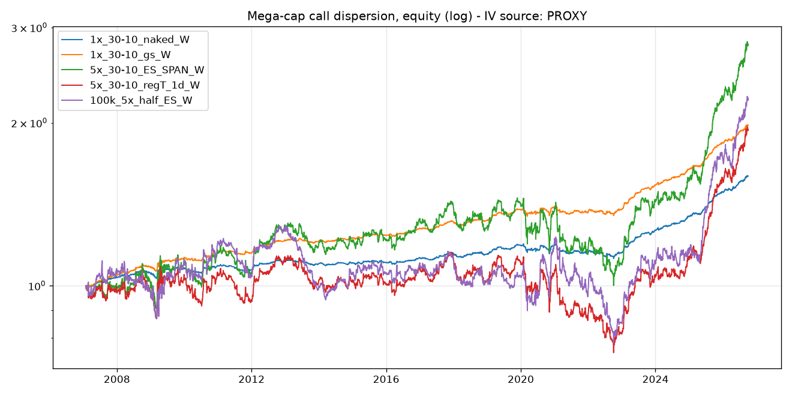

# Mega-cap Call Dispersion (GS institutional + tastytrade retail)

Systematic options strategy: **long single-name upside convexity, short index
upside convexity**, delta- and notional-matched, hedged weekly. Built from
scratch to the specification in the build prompt: point-in-time universe,
monthly cycle, Black-Scholes flat-IV backtest with explicit retail /
institutional costs, and an execution layer for tastytrade (ES/MES futures
options under SPAN) or a prime broker (naked SPY calls under portfolio margin).

```
dispersion/
  config.py              every parameter of the spec (deltas, sizing, costs, rails)
  bs.py                  Black-Scholes pricing/delta + K = S*exp(-z_d*s + s^2/2) strike rule
  data/constituents.py   point-in-time S&P 500 membership (fja05680/sp500, no survivorship)
  data/prices.py         yfinance daily closes / volume / shares / splits, parquet cache
  data/universe.py       top-100 by market cap -> top-30 by trailing-12m median $ volume
  data/rates.py          FRED FEDFUNDS, VIXCLS, CBOE single-name vol indices
  data/iv.py             IV provider: ORATS/VolVue/IvyDB CSV loaders + labelled PROXY fallback
  backtest/engine.py     monthly roll, weekly hedge, costs, leverage, Reg-T / naked / ES variants
  backtest/metrics.py    CAGR, vol, Sharpe, Sortino, maxDD, Calmar, beta, yearly, 2nd-half
  execution/strikes.py   listed-chain strike selection from IV30 (furthest strike for the 1-delta wing)
  execution/sizing.py    0.9*L/N sizing, rotating 15-name half, 2x-contract skip, margin/flatten rails
  execution/orders.py    limit-walk algorithm: mid -> far side in 3-4 steps of 20% half-spread, 15-20 s
  execution/hedge.py     weekly net $-delta at entry IVs -> SPY shares or MES
  execution/broker.py    Broker interface + PaperBroker (synthetic chains/quotes for offline validation)
  execution/tastytrade.py OAuth2, chains, quotes, order & margin dry-run, submit/replace/cancel
  execution/institutional.py naked SPY (or 1-delta Reg-T spread) index ticket, GS cost model
  execution/runner.py    CLI: roll / hedge / status, dry-run first, 60% margin rail
scripts/fetch_data.py    download everything
scripts/run_backtest.py  run the variant grid, write results/summary_<TAG>.csv
scripts/report.py        markdown table vs reference numbers + equity chart
tests/                   16 tests: BS/delta targets, strike picks, sizing, rails, hedge, limit walk, engine accounting
```

## Quick start

```bash
pip install -r requirements.txt
python scripts/fetch_data.py          # ~10 min: 976 historical S&P tickers, shares, splits, FRED
python scripts/run_backtest.py        # all variants, 2007-01 .. today
python scripts/report.py PROXY        # table + results/equity_PROXY.png
python -m pytest -q
# execution, offline mechanics check (no credentials needed):
python -m dispersion.execution.runner roll  --paper --dry-run --leverage 3 --index-mode ES
python -m dispersion.execution.runner hedge --paper --dry-run
```

## The critical input: implied vols

The spec is explicit that entry IVs must be **traded** 30-day IVs (ORATS,
OptionMetrics/IvyDB, LiveVol, VolVue) and that realized-vol proxies inflate the
numbers. **No licensed IV source is reachable from this build**, so the
reference numbers in spec section 8 are *not* reproduced here. What is in place:

* `data/iv.py` loads any of those vendors from CSV dropped in `data/iv/`
  (format table in `data/iv/README.md`); the run then relabels itself
  `LICENSED` and that is the run to compare with section 8.
* Until then the engine falls back to **PROXY IV**, labelled as such on every
  output: SPY IV = VIX (a true implied, so no crash lag at the index level);
  single-name IV = VIX x (63-day realized vol ratio to SPY, clipped 1.0-3.0), overridden
  by the real CBOE single-name indices (AAPL, AMZN, GOOGL, GS, IBM) where FRED has them.
  Diagnostics on this proxy: cross-sectional median single/SPY ratio 1.60
  (spec: 1.59 traded, 1.57 break-even); on the five names with real indices the
  proxy and the real median ratios agree to two decimals. What the proxy cannot
  see is single-name event premia and the call-wing skew, which is where the
  spec locates the richness, so it is expected to under-collect.

## Results (PROXY IV, 2007-01 .. 2026-10, net of the spec's retail costs)



| variant                      | cagr   | vol    |   sharpe |   sortino | maxdd   |   calmar |   calmar_2h |   beta | worst_month   | y2008   | y2022   | reference (spec section 8) |
|:-----------------------------|:-------|:-------|---------:|----------:|:--------|---------:|------------:|-------:|:--------------|:--------|:--------|:---------------------------|
| 1x_30-10_naked_W             | +2.4%  | 2.4%   |     1.00 |      1.37 | -6.1%   |     0.39 |        0.59 |   0.05 | -1.8%         | +1.9%   | -0.1%   | Sharpe 1.36, maxDD -2.9%, Calmar 1.07, gross +2.97%/yr, net +2.2..3.1% |
| 1x_30-10_naked_nohedge       | +1.8%  | 2.6%   |     0.69 |      0.82 | -6.6%   |     0.27 |        0.47 |   0.01 | -2.1%         | +2.2%   | +1.7%   | (hedge matters) |
| 1x_30-10_naked_D             | +2.2%  | 2.3%   |     0.97 |      1.43 | -5.3%   |     0.43 |        0.70 |   0.06 | -1.1%         | +0.1%   | -1.4%   | daily = no Sharpe gain over weekly |
| 1x_longcall_naked_W          | +0.5%  | 3.3%   |     0.16 |      0.21 | -31.6%  |     0.01 |        0.21 |   0.04 | -1.9%         | -2.1%   | -2.6%   | 30-10 vertical is the right structure |
| 1x_30-10_regT_1d_W           | +2.1%  | 2.4%   |     0.88 |      1.18 | -6.6%   |     0.32 |        0.51 |   0.05 | -1.8%         | +1.6%   | -0.3%   | ~0.1 Sharpe below naked |
| 1x_30-10_regT_5d_W(rejected) | +0.8%  | 2.3%   |     0.35 |      0.42 | -15.7%  |     0.05 |        0.22 |   0.03 | -1.5%         | +0.3%   | -1.2%   | rejected: 5-delta wing |
| 1x_30-10_gs_W                | +3.5%  | 2.4%   |     1.46 |      2.19 | -4.3%   |     0.81 |        1.06 |   0.05 | -1.7%         | +3.5%   | +0.9%   | institutional costs |
| 5x_30-10_naked_W             | +5.0%  | 11.4%  |     0.48 |      0.62 | -31.7%  |     0.16 |        0.24 |   0.27 | -9.5%         | +1.7%   | -7.3%   | +17.7%/yr, vol 11.5%, Sharpe 1.54, Sortino 3.4, maxDD -13.6%, Calmar 1.31, beta 0.37, worst -7.0%, 2008 +15% |
| 5x_30-10_ES_SPAN_W           | +5.3%  | 11.4%  |     0.51 |      0.67 | -31.1%  |     0.17 |        0.26 |   0.27 | -9.5%         | +2.3%   | -7.0%   | default retail product |
| 5x_30-10_regT_1d_W           | +3.4%  | 11.3%  |     0.35 |      0.45 | -34.8%  |     0.10 |        0.18 |   0.25 | -9.3%         | +0.0%   | -8.2%   | Sharpe 1.46-1.55, Calmar 1.19-1.28 |
| 5x_30-10_gs_W                | +10.9% | 11.4%  |     0.96 |      1.40 | -23.3%  |     0.47 |        0.55 |   0.27 | -9.1%         | +9.9%   | -2.5%   | |
| 100k_5x_half_ES_W            | +4.1%  | 13.0%  |     0.37 |      0.51 | -39.3%  |     0.10 |        0.21 |   0.30 | -7.9%         | -8.5%   | -13.5%  | +19.6%/yr, Sharpe 1.44, Calmar 1.12 |
| 3x_30-10_ES_SPAN_W           | +4.0%  | 6.9%   |     0.60 |      0.80 | -19.1%  |     0.21 |        0.31 |   0.16 | -5.6%         | +2.2%   | -3.5%   | recommended live start |

Gross/net decomposition at 1x (same run): gross ex-cash **+2.4%/yr** (spec
+2.97%), retail half-spread costs 1.6%/yr, commissions 0.6%/yr, cash yield
on equity +1.9%/yr. The spec's "~0.7%/yr retail" headline corresponds to the
30-delta leg alone at its 3% x 1.3 half-spread; applying the stated per-leg
parameters to all legs gives the figure above.

What reproduces and what does not:

* **Reproduces (structure):** near-zero beta at 1x (0.05), crisis profile
  (2008 positive, 2022 roughly flat at 1x, losses from single-name droughts),
  weekly hedge > daily hedge > no hedge, 30-10 vertical >> bare long call,
  1-delta Reg-T wing costs ~0.1 Sharpe while the 5-delta wing is rejected,
  institutional costs add ~0.5 Sharpe, vol at 5x = 11.4% (spec 11.5%).
* **Does not reproduce (level):** Sharpe 1.00 vs 1.36 at 1x, and at 5x the
  compounding of a thinner sleeve return under heavier costs gives +5% vs
  +17.7%/yr with a -31% drawdown. Two causes, both anticipated by the spec:
  the proxy IV under-collects the single-name call wing, and yfinance has no
  prices for names delisted before today, so the 2007-2012 universe misses
  the LEH/BSC/WB-type names whose IV was richest. Coverage is still 30/30
  slots every month. Put licensed IVs in `data/iv/` and rerun before drawing
  conclusions about the level; the second-half Calmar (`calmar_2h`) is the
  forward expectation to use, per the spec.

## Mechanics implemented (spec sections)

* **Universe (2):** PIT S&P membership -> top-100 by market cap (raw close x
  shares; Yahoo shares history starts 2015, earlier dates back-fill through
  splits) -> top-30 by trailing-12m median daily dollar volume, shifted one
  month. Breadth floor 13 names (skip the month below it). No other filters.
* **Cycle (3):** month-end to month-end, one expiry. Long 30d / short 10d call
  per name at 0.9*L*E/N; short 30d index calls notional-matched to what was
  actually deployed; naked (PM / SPAN) or 1-delta wing (Reg-T). MES below
  $300k short notional, ES above. Strike rule
  `K = S*exp(-z_d*s + s^2/2)`, z = -0.5244 / -1.2816 / -2.3263; live chains
  take the nearest listed strike, furthest listed for an off-chain 1-delta wing.
* **Hedge (4):** every 5th trading day, sum of BS dollar deltas at entry IV
  with remaining time, neutralised in SPY shares (backtest) or SPY / MES (live).
  Measured turnover ~0.3x book/month.
* **Sizing (5):** reset from equity monthly; `Rails.never_scale_up_after_loss`
  blocks recovery sizing; margin > 60% of equity cuts L by one at the next roll;
  equity under floor + 10% buffer flattens the short leg first. Small accounts
  (< $276k x L/5) trade the rotating 15-name half and skip any name whose single
  contract exceeds 2x its target notional.
* **Costs (6):** half-spread % of premium x1.3 (1.5/3/8/15% singles by delta,
  0.5% SPY, 0.3% ES/MES), 1bp of hedge turnover, $1/contract to open on
  real (unadjusted) contract counts, GS 1.5% flat. Cash on equity at FEDFUNDS.
* **Execution (10):** limit at mid walked toward the far side in 4 steps of 20%
  of the half-spread, 15-20 s apart; verticals as single 2-leg tickets; every
  ticket dry-run first; whole-roll margin dry-run (`POST /margin/accounts/{acct}/dry-run`)
  before any submit; unique `external-identifier` on every order and a
  live-orders lookup before any resubmit (tastytrade does not deduplicate).

## Going live on tastytrade

1. Create an OAuth app and a personal grant on my.tastytrade.com (sandbox and
   production are separate apps). Export `TT_ENV=sandbox|prod`,
   `TT_CLIENT_SECRET`, `TT_REFRESH_TOKEN`, optionally `TT_ACCOUNT`.
   The sandbox serves no market data: set `TT_PROD_REFRESH_TOKEN` /
   `TT_PROD_CLIENT_SECRET` and quotes come from production while orders go to
   the sandbox (sandbox fills are synthetic: limits under $3 fill, above never).
2. `python -m dispersion.execution.runner status`
3. On the last trading day of the month:
   `python -m dispersion.execution.runner roll --leverage 3 --index-mode ES --dry-run`
   then without `--dry-run`. Compare realized entry debits/credits against the
   `model` block (BS at the live ATM-implied IV30) for 3+ months at L=1-3 before L=5.
4. Weekly: `python -m dispersion.execution.runner hedge --index-mode ES`.
5. `--index-mode SPY` for a portfolio-margin account (naked SPY calls),
   `--index-mode SPY_REGT` for a Reg-T account (30-delta / 1-delta credit spread).

## Rejected by the spec and deliberately absent

Short puts anywhere; put-side ladders, ATM short legs, strangles;
momentum / top-10 name selection; regime filters on the short index leg;
un-rebalanced drift; loss-scaled sizing; index wings nearer than ~2-delta.
